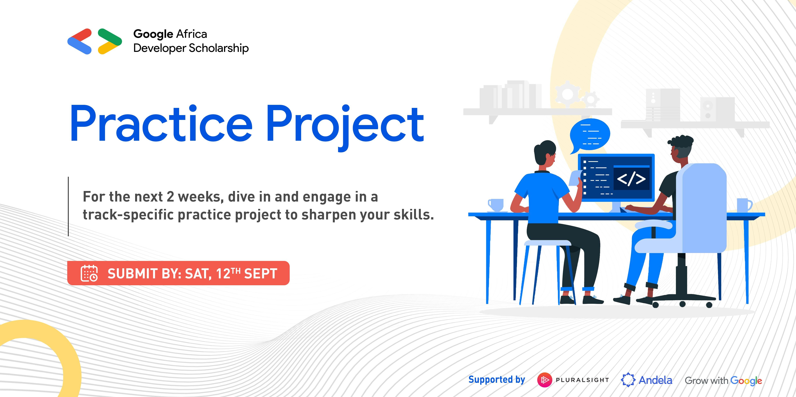

# gcp-practiceproject
# GCP Practice Project during Phase II

## Description  

During Learning Phase 2 participants in the Cloud track of the GADS 2020 program shall be encouraged to explore the possibilities and opportunities to work with the gcloud SDK more in detail.  Due to limitations in regards to accessing free Google Cloud Platform (GCP), the Google Cloud challenge is based on the available hands-on labs on Qwiklabs provided by Pluralsight. Learners in the Cloud track have free access to a selection of fundamental labs on GCP.  

## The playground  
All Google Cloud learners have access to multiple learning channels on Pluralsight. Each channel provides access to several video courses, and you have access to various labs through Qwiklabs.   The total of hands-on labs is 168 labs (as of writing). All links are provided below as an annex.  

## The challenge(s)  T

The Cloud challenge is divided in two parts:  

**1** Complete of 10-15 selected hands-on labs on Qwiklabs and submitting proof of such per screenshot based on the email received. 
**2** “Translation” of 2-3 selected labs from Console instructions to 100% command line instructions.  

## Submission  

The result of both challenges shall be documented in a Github repository  
 
 - **1** How to get started with Github is an available course to learners via the Associate Cloud Engineer Foundational Deep Dive Channel (2020) 
 
 - **2** Submit the documented github repo to the GADS Team here  - bit.ly/GADSPracticeProjectSubmission

# LABs : 
## Course : Google Cloud Platform Fundamentals - Core Infrastructure

### Module :  Getting Started with Google Cloud Platform
#### GCP Fundamentals: Getting Started with Cloud Marketplace ✅

### Module :  Virtual Machines in the Cloud
#### GCP Fundamentals: Getting Started with Compute Engine ✅

### Module :  Storage in the Cloud
#### Module: GCP Fundamentals: Getting Started with Cloud Storage and Cloud SQL ✅

### Module: Containers in the Cloud
#### GCP Fundamentals: Getting Started with Kubernetes Engine  ✅ 

### Module: Applications in the Cloud
#### GCP Fundamentals: Getting Started with App Engine ✅

### Module: Developing, Deploying and Monitoring in the Cloud
#### GCP Fundamentals: Getting Started with Deployment Manager and Stackdriver ✅

### Module: Big Data and Machine Learning in the Cloud
### GCP Fundamentals: Getting Started with BigQuery ✅

## Course : Getting Started With Application Development on Google Cloud

### Module: Google Cloud Client Libraries, Google Cloud SDK, and Google Firebase SDK 
#### App Dev: Setting up a Development Environment v1.1 ✅

### Module : Best Practices for Using Cloud Datastore
#### App Dev: Storing Application Data in Cloud Datastore v1.1 ✅

### Module : Best Practices for Using Cloud Storage
#### App Dev: Storing Image and Video Files in Cloud Storage v1.1 ❌

## Course: Google Cloud Platform Big Data and Machine Learning Fundamentals

### Module: Introduction to Google Cloud Platform ❌
#### Lab: Explore a BigQuery Public Dataset

### Module : Recommending Products using Cloud SQL and Spark
#### Lab: Recommend Products using ML with Cloud SQL and Dataproc ❌

### Module : Predict Visitor Purchases Using BigQuery ML
#### Lab: Predict Visitor Purchases with a Classification Model with BigQuery ML ❌

### Module : Create Streaming Data Pipelines with Cloud Pub/sub and Cloud Dataflow
#### Lab: Create a Streaming Data Pipeline for a Real-Time Dashboard with Cloud Dataflow ❌

### Module : Classify Images with Pre-Built Models using Vision API and Cloud AutoML
#### Lab: Classify Images with Pre-built ML Models using Cloud Vision API and AutoML ❌

