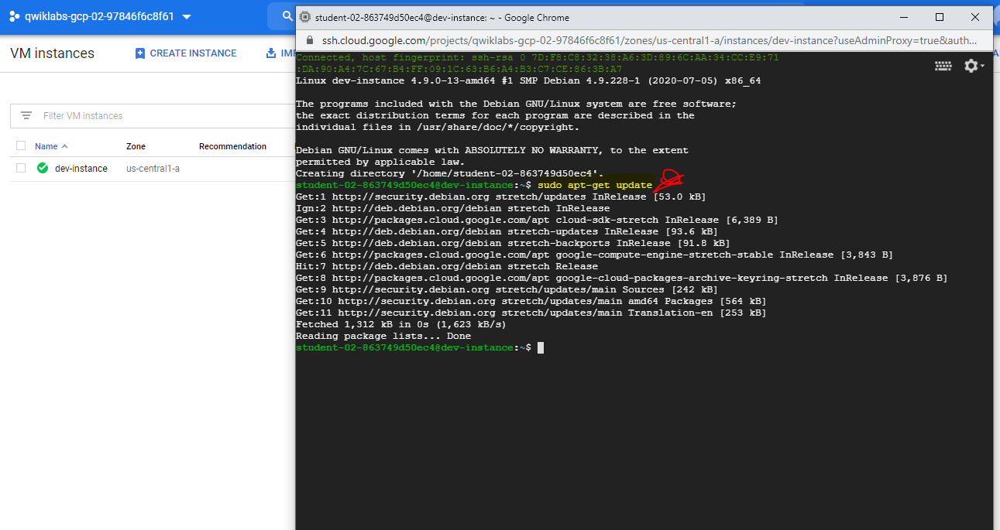
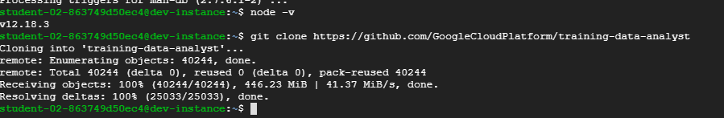

# Overview
In this lab, you will provision a Google Compute Engine virtual machine and install software libraries for Node.js software development on Google Cloud Platform.

# Objectives

In this lab, you will learn how to perform the following tasks:

Provision a Google Compute Engine instance.

Connect to the instance using SSH.

Install software on the instance.

Verify the software installation.

# Setup
GCP Console Ressources :

###########################################
Username : student-02-863749d50ec4@qwiklabs.net

Password : 5fzC68tnNCJZ

GCP Project ID : qwiklabs-gcp-02-97846f6c8f61

###########################################

# Task 1: Creating a Compute Engine Virtual Machine Instance
In this section, you will use the Google Cloud Platform Console to provision a new Google Compute Engine virtual machine instance.

1_In the Cloud Platform Console, on the Navigation menu, click Compute Engine.

2_On the VM Instances page, click Create.

3_On the Create an instance page, for Name type dev-instance, select us-central1 for region and us-central1-a for the zone.
**Note** : GCP Regions and Zones
Google Cloud Platform offers products and services in multiple distinct geographic locations, called regions.
Each region has multiple distinct zones. Each zone is isolated from other zones in terms of power and internet connectivity.

4_In the Identity and API access > Access Scopes section, select Allow full access to all Cloud APIs.

5_In the Firewall section, enable Allow HTTP traffic.

6_Leave the remaining settings as their defaults, and click Create. (  20 seconds for the virtual machine to be provisioned and started.)

7_On the VM instances page, in the row for the dev-instance, click SSH (in the Connect column).

# Task 2: Install software on the VM instance

1_In the SSH session, to update the Debian package list, execute the following command:
> sudo apt-get update

2_To install Git, execute the following command:
> sudo apt-get install git

If prompted, press Enter.

3_To download the Node.js setup script, execute the following command:
> curl -sL https://deb.nodesource.com/setup_6.x | sudo -E bash -

**Note** : Node_6.x is Deprecated should replace it with newer versions such as 12.x
4_To install npm and Node.js, execute the following command:
> sudo apt install nodejs

# Task 3: Configure the VM to Run Application Software
In this section, you will verify the software installation and run some sample codes.

1_To check the version of Node.js, execute the following command:
> node -v
You should see the Node.js version number for version 6.

2_To clone the class repository, execute the following command:
> git clone https://github.com/GoogleCloudPlatform/training-data-analyst

3_To change the working directory, execute the following command:
> cd ~/training-data-analyst/courses/developingapps/nodejs/devenv/

4_To run a simple web server, execute the following command:
> sudo node server/app.js

5_Return to the Cloud Console VM instances list, and click on the External IP address for the dev-instance.
  
    You should see a Hello GCP dev! message from Node.js.

6_Return to the SSH window, and stop the application by pressing Ctrl+C.

7_To install the Node.js library for Compute Engine, execute the following command:
> npm install

8_To run a simple Node.js application that lists Compute Engine instances, execute the following command:
> node list-gce-instances.js
  
   Many details about your machine should appear in the terminal window.
   
**Warning** : If you try to do this on your own machine, it will not work if no credentials have been set up to access GCP on your machine

