# Overview
In this lab, you will review the case study application, an online Quiz. You will store application data for the Quiz application in Cloud Datastore.

The Quiz application skeleton has already been written for you. You will clone a repository that contains the skeleton using Google Cloud Shell, 
review the code using the Cloud Shell editor, and view it using the Cloud Shell web preview feature.

Then you will modify the code that stores data to use Cloud Datastore.

# Objectives

In this lab, you will learn how to perform the following tasks:

Harness Cloud Shell as your development environment.

Integrate Cloud Datastore into a NodeJS application.

# Setup
GCP Console Ressources 
#####################################

Username : student-02-fe67c16402f6@qwiklabs.net

Password : p8bWT5Lkp4K

GCP Project ID : qwiklabs-gcp-02-bc332d3234bc


#####################################

# Previewing the Case Study Application
In this section, you will access Cloud Shell, clone the git repository containing the Quiz application, and run the application.

- **Clone source code in Cloud Shell**

1. On the Cloud Platform Console, click Activate Google Cloud Shell. **(>_)**

2. If a dialog box appears, click Start Cloud Shell.

3. To clone the repository for the class, execute the following command:
> git clone https://github.com/GoogleCloudPlatform/training-data-analyst

- **Configure and run the case study application**
1. To change the working directory, execute the following command:
> cd ~/training-data-analyst/courses/developingapps/nodejs/datastore/start

2. To export an environment variable, GCLOUD_PROJECT that references the GCP Project ID, execute the following command:
> export GCLOUD_PROJECT=$DEVSHELL_PROJECT_ID

**Note:** GCP Project ID in Cloud Shell
While working in Cloud Shell, you will have access to the Project ID in the $DEVSHELL_PROJECT_ID environment variable.

3. To install the application dependencies, execute the following command:
> npm install
__The installation may take a couple of minutes.__

4. To run the application, execute the following command:
> npm start

__Review the case study application__

1. In **Cloud Shell**, click **Web preview > Preview on port 8080** to preview the quiz application.

> You should see the user interface for the web application. The three main parts to the application are:

>> 1. Create Question
>> 2. Take Test
>> 3. Leaderboard

2. In the navigation bar, click __Create Question.__
3. In the navigation bar, click Take Test.
4. In the navigation bar, click GCP.
5. To return to the server-side application, click on the Quite Interesting Quiz link in the navigation bar.

__Examining the Case Study Application Code__
In this section, you will use the Cloud Shell text editor to review the case study application code.

- Employ the Cloud Shell Editor

1. From Cloud Shell, click Launch code editor.
2. Navigate to the **/training-data-analyst/courses/developingapps/nodejs/datastore/start/server** folder using the file browser panel on the left side of the editor

__Review the Express Web application__

1. Select the **.../datastore/start/server/app.js** file.
2. Select the **.../datastore/start/server/web-app** folder.
3. Select the **.../datastore/start/server/web-app/questions.js** file.
4. In the **questions.js** file, find the handler that responds to HTTP POST requests for the **/questions/add** route.
5. Select the **.../datastore/start/server/web-app/views** folder.
6. View the **.../datastore/start/server/web-app/views/questions/add.pug** file.
7. Select the **.../datastore/start/server/api/index.js** file.
8. Select the **.../datastore/start/server/gcp/datastore.js** file.

__ Adding Entities to Cloud Datastore __

Doing some Coding in the ** To DO **  should be updated.

**Create an App Engine application to provision Cloud Datastore**

1. Return to Cloud Shell and stop the application by pressing Ctrl+C.
2. To create an App Engine application in your project, execute the following command in Cloud Shell:
> gcloud app create --region "us-central"

__ Import and use the NodeJS Datastore module__ 
1. Open the **...gcp/datastore.js** file in the Cloud Shell editor.
2. Load the config module from the parent folder.
3. Load the **@google-cloud/datastore** module.
4. Declare a Datastore client object named ds.

__datastore.js__
```
// TODO: Load the ../config module

const config = require('../config');

// END TODO

// TODO: Load the @google-cloud/datastore module

const Datastore = require('@google-cloud/datastore');

// END TODO

// TODO: Create a Datastore client object, ds
// The Datastore(...) factory function accepts an options // object which is used to specify which project's
// Datastore should be used via the projectId property.
// The projectId is retrieved from the config module. This // module retrieves the project ID from the GCLOUD_PROJECT // environment variable.

const ds = Datastore({
 projectId: config.get('GCLOUD_PROJECT')
});

// END TODO

```

__Write code to create a Cloud Datastore entity__

1. Declare a constant named kind, initialized with the value 'Question'.

**datastore.js**

```
// TODO: Declare a constant named kind
//The Datastore key is the equivalent of a primary key in a // relational database.
// There are two main ways of writing a key:
// 1. Specify the kind, and let Datastore generate a unique //    numeric id
// 2. Specify the kind and a unique string id

const kind = 'Question';

// END TODO
```


2. In the create(...) function, remove the existing Promise.resolve({}) placeholder statement from the create(...) function.

3. Declare a constant called key to store the key for this entity.

4. Declare a constant named entity and initialize it with the key and the quiz question properties extracted from the form data.

5. Use the Datastore client object (ds) to save the entity by calling the save(entity) method.

__datastore.js__

```
// The create({quiz, author, title, answer1, answer2,
// answer3, answer4, correctAnswer}) function uses an
// ECMAScript 2015 destructuring assignment to extract
// properties from the form data passed to the function

function create({ quiz, author, title, answer1, answer2,
                  answer3, answer4, correctAnswer }) {
 // TODO: Declare the entity key,
 // with a Datastore generated id

 const key = ds.key(kind);

 // END TODO

 // TODO: Declare the entity object, with the key and data

 const entity = {
   key,
// The entity's members are represented in a data property.
// This is an array where each element represents one
// member in the entity. Each element is an object with a // name and a value
   data: [
     { name: 'quiz', value: quiz },
     { name: 'author', value: author },
     { name: 'title', value: title },
     { name: 'answer1', value: answer1 },
     { name: 'answer2', value: answer2 },
     { name: 'answer3', value: answer3 },
     { name: 'answer4', value: answer4 },
     { name: 'correctAnswer', value: correctAnswer },
   ]
 };
 // END TODO

// TODO: Save the entity, return a promise
 // The ds.save(...) method returns a Promise to the
 // caller, as it runs asynchronously.

 return ds.save(entity);

 // END TODO
}
```

__Run the application and create a Cloud Datastore entity__


1. Save the ...gcp/datastore.js file and then return to the Cloud Shell command prompt.

2. To start the application, execute the following command:

```npm start```

3. In Cloud Shell, click Web preview > Preview on port 8080 to preview the quiz application.
4. Click __Create Question__.
5. Complete the form with the following values, and then click Save.
```
|--------------|--------------------------|
| Form Field   | Value                    | 
|--------------|--------------------------|
| Author       | Your Name                |
|--------------|--------------------------|
| Quiz         | Google Cloud Platform    |
|--------------|--------------------------|
| Title        | Which company owns GCP?  |
|--------------|--------------------------|
| Answer 1     | Amazon                   |
|--------------|--------------------------|
| Answer 2     | **Google**               |
|--------------|--------------------------|
| Answer 3     | IBM                      |
|--------------|--------------------------|
| Answer 4     | Microsoft                |
|--------------|--------------------------|

```

- You should be returned to the home page for the application.


6. Return to the __Cloud Platform Console__ and, on the __Navigation menu__, click __Datastore__.
7. On the __Datastore page__, click __Entities__.


**Result : You should see your new question!**


## Bonus: Querying Cloud Datastore

In this section, you will write code to retrieve entity data from Cloud Datastore.

__Write code to retrieve Cloud Datastore entities__


1. Return to the code editor.

2. In the ...gcp/datastore.js file, remove the code from the list(quiz)method.

3. In the list(...) method, a query that retrieves Question entities for a specific quiz from Cloud Datastore.

4. Use the Datastore client to run the query, and assign the returned promise object to a constant.

5. Write a statement to return the promise.

6. Chain a then(...) method to the promise.

7. Write an arrow function in the then(...) method to retrieve the response from Cloud Datastore.

8. In the arrow function extract the results from the response.

9. Reshape the data by adding each entity ID and removing the correct answer from the data returned from Cloud Datastore.

10. Complete the code in the arrow function body to return a page of entities or an object that indicates that this is the last page of results.

__Run the application and test the Cloud Datastore query__


1. Save the ...gcp/datastore.js file, and then return to the Cloud Shell command.
2. Stop the application by pressing Ctrl+C.
3. Start the application.
4. In Cloud Shell, click Web preview > Preview on port 8080 to preview the quiz application.
5. Replace the querystring at the end of the application's URL with /api/quizzes/gcp.
```
The URL will be in the form: https://8080-dot-####-dot-devshell.appspot.com/api/quizzes/gcp

You should see that JSON data has been returned to the client corresponding to the question you added in the web application!
```

6. Return to the application home page, and click Take Test.
7. Click GCP.

```You should see that the quiz question has been formatted inside the client-side web application!```

__HINT__ : ```You can find the solution to the bonus in the lab's bonus folder.```


**Extras**

 __datastore.js__ File: 
 
 ```
 // Copyright 2017, Google, Inc.
// Licensed under the Apache License, Version 2.0 (the "License");
// you may not use this file except in compliance with the License.
// You may obtain a copy of the License at
//
//    http://www.apache.org/licenses/LICENSE-2.0
//
// Unless required by applicable law or agreed to in writing, software
// distributed under the License is distributed on an "AS IS" BASIS,
// WITHOUT WARRANTIES OR CONDITIONS OF ANY KIND, either express or implied.
// See the License for the specific language governing permissions and
// limitations under the License.
'use strict';

const Datastore = require('@google-cloud/datastore');
const config = require('../config');

// [START config]
const ds = Datastore({
  projectId: config.get('GCLOUD_PROJECT')
});
const kind = 'Question';
// [END config]


// Lists all questions in a Quiz (defaults to 'gcp').
// Returns a promise
// [START list]
function list(quiz = 'gcp', redact = true) {
  const q = ds.createQuery([kind])
    .filter('quiz', '=', quiz);

  const p = ds.runQuery(q);

  return p.then(([results, { moreResults, endCursor }]) => {
    const questions = results.map(item => {
      item.id = item[Datastore.KEY].id;
      if (redact) {
        delete item.correctAnswer;
      }
      return item;
    });
    return {
      questions,
      nextPageToken: moreResults != 'NO_MORE_RESULTS' ? endCursor : false
    };
  });
}
// [END list]

// [START create]
function create({ quiz, author, title, answer1, answer2, answer3, answer4, correctAnswer, imageUrl }) {

  const key = ds.key(kind);

  const entity = {
    key,
    data: [
      { name: 'quiz', value: quiz },
      { name: 'author', value: author },
      { name: 'title', value: title },
      { name: 'answer1', value: answer1 },
      { name: 'answer2', value: answer2 },
      { name: 'answer3', value: answer3 },
      { name: 'answer4', value: answer4 },
      { name: 'correctAnswer', value: correctAnswer },
      { name: 'imageUrl', value: imageUrl },
    ]
  };
  return ds.save(entity);
}
// [END create]

// [START exports]
module.exports = {
  create,
  list
};
// [END exports]

 ```


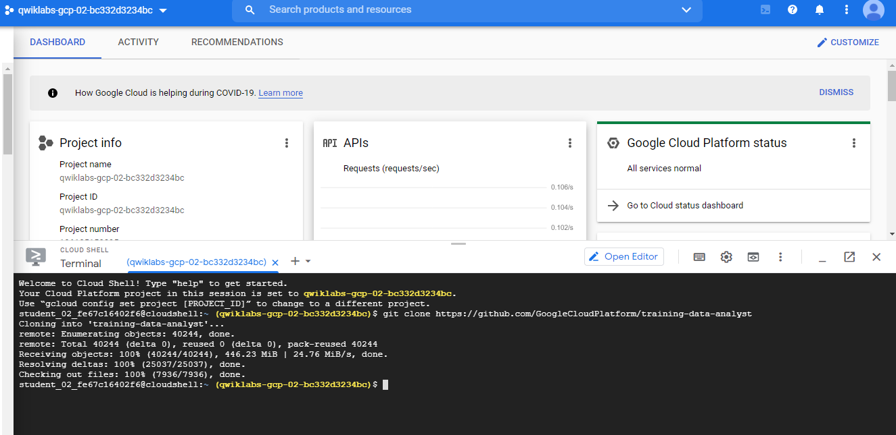
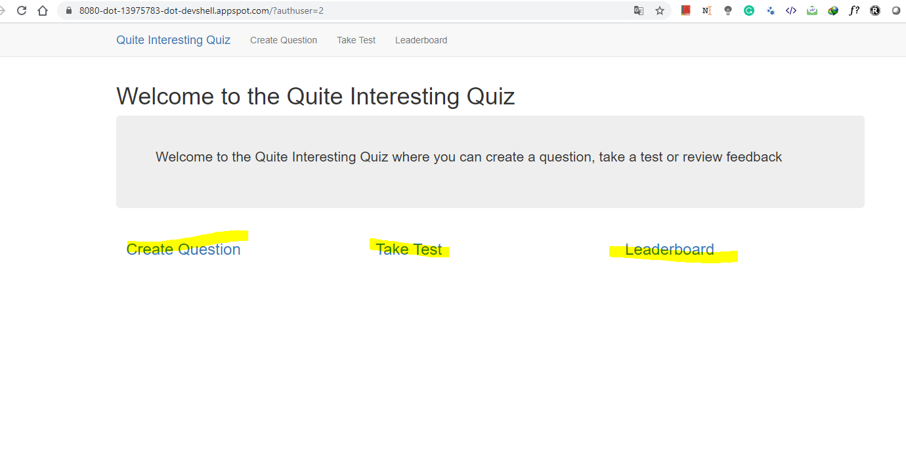
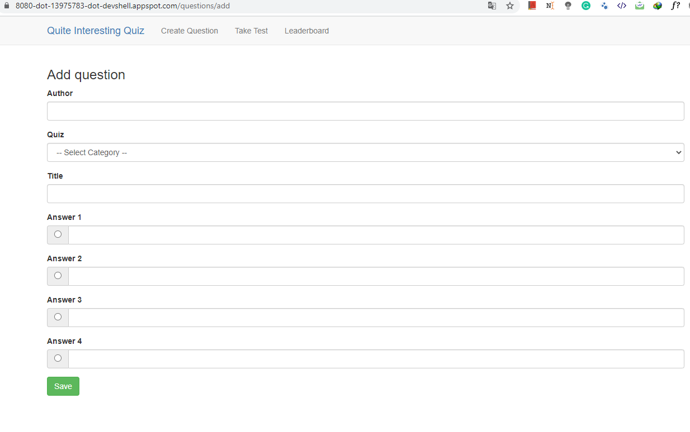
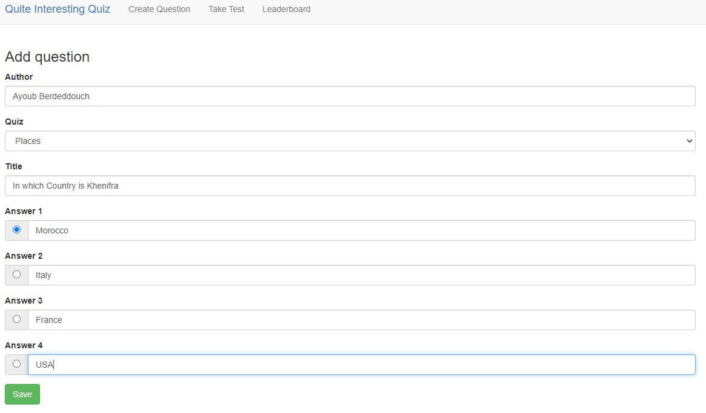
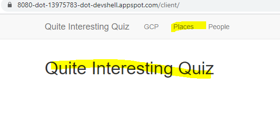

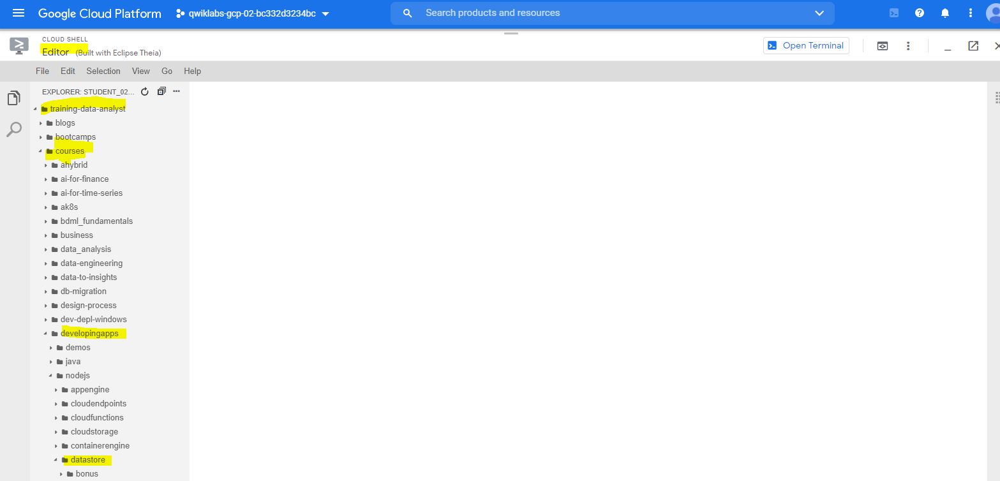
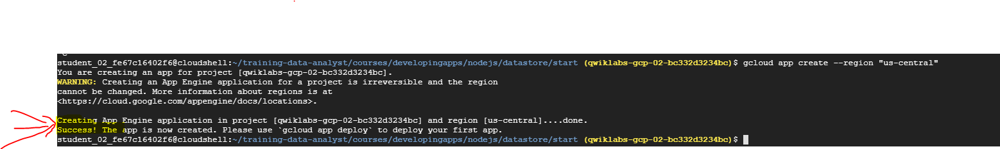
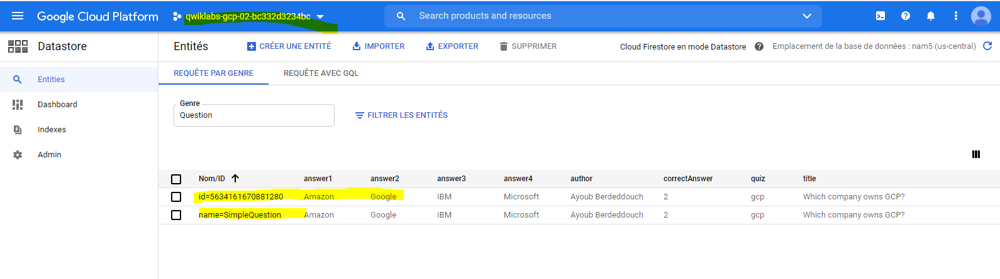
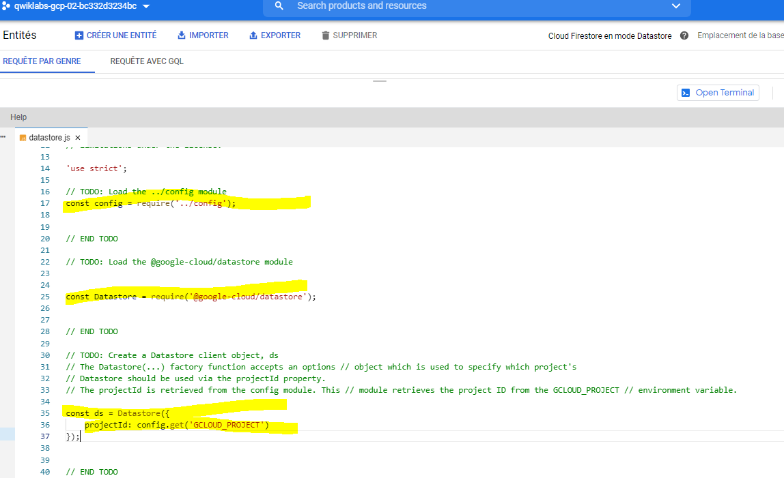
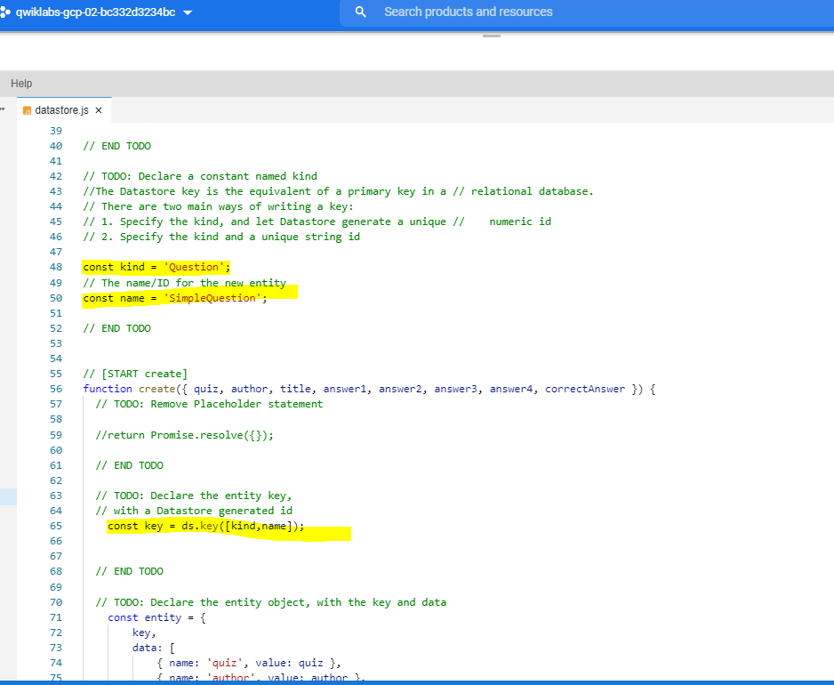
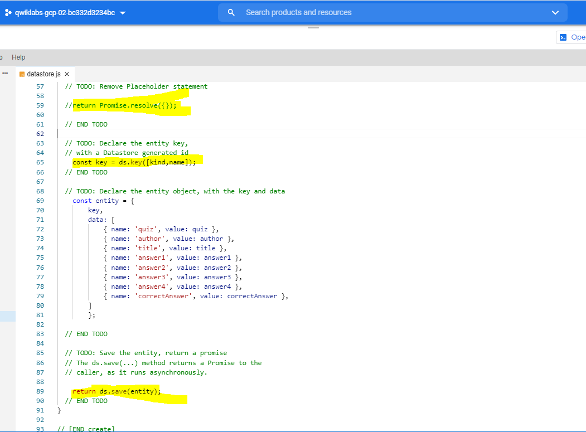
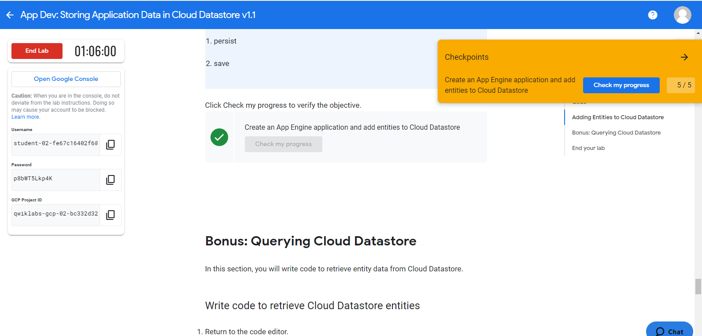
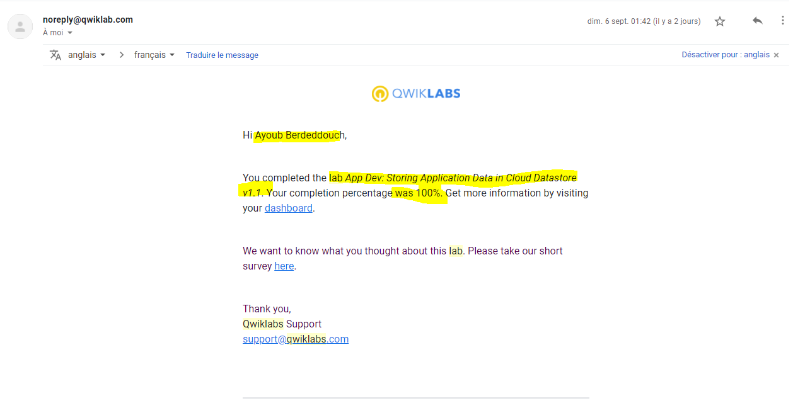


