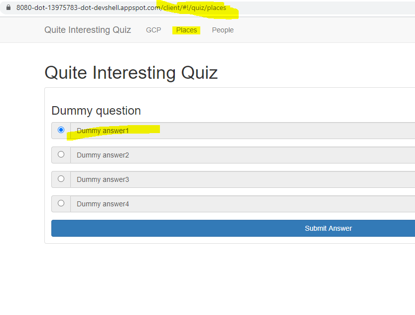

# Overview
In this lab, you will review the case study application, an online Quiz. You will store application data for the Quiz application in Cloud Datastore.

The Quiz application skeleton has already been written for you. You will clone a repository that contains the skeleton using Google Cloud Shell, 
review the code using the Cloud Shell editor, and view it using the Cloud Shell web preview feature.

Then you will modify the code that stores data to use Cloud Datastore.

# Objectives

In this lab, you will learn how to perform the following tasks:

Harness Cloud Shell as your development environment.

Integrate Cloud Datastore into a NodeJS application.

# Setup
GCP Console Ressources 
#####################################

Username : student-02-fe67c16402f6@qwiklabs.net

Password : p8bWT5Lkp4K

GCP Project ID : qwiklabs-gcp-02-bc332d3234bc

#####################################

# Previewing the Case Study Application
In this section, you will access Cloud Shell, clone the git repository containing the Quiz application, and run the application.

- **Clone source code in Cloud Shell**

1. On the Cloud Platform Console, click Activate Google Cloud Shell. **(>_)**

2. If a dialog box appears, click Start Cloud Shell.

3. To clone the repository for the class, execute the following command:
> git clone https://github.com/GoogleCloudPlatform/training-data-analyst

- **Configure and run the case study application**
1. To change the working directory, execute the following command:
> cd ~/training-data-analyst/courses/developingapps/nodejs/datastore/start

2. To export an environment variable, GCLOUD_PROJECT that references the GCP Project ID, execute the following command:
> export GCLOUD_PROJECT=$DEVSHELL_PROJECT_ID

**Note:** GCP Project ID in Cloud Shell
While working in Cloud Shell, you will have access to the Project ID in the $DEVSHELL_PROJECT_ID environment variable.

3. To install the application dependencies, execute the following command:
> npm install
__The installation may take a couple of minutes.__

4. To run the application, execute the following command:
> npm start

__Review the case study application__

1. In **Cloud Shell**, click **Web preview > Preview on port 8080** to preview the quiz application.

> You should see the user interface for the web application. The three main parts to the application are:

>> 1. Create Question
>> 2. Take Test
>> 3. Leaderboard

2. In the navigation bar, click __Create Question.__
3. In the navigation bar, click Take Test.
4. In the navigation bar, click GCP.
5. To return to the server-side application, click on the Quite Interesting Quiz link in the navigation bar.

__Examining the Case Study Application Code__
In this section, you will use the Cloud Shell text editor to review the case study application code.

- Employ the Cloud Shell Editor

1. From Cloud Shell, click Launch code editor.
2. Navigate to the **/training-data-analyst/courses/developingapps/nodejs/datastore/start/server** folder using the file browser panel on the left side of the editor

__Review the Express Web application__

1. Select the **.../datastore/start/server/app.js** file.
2. Select the **.../datastore/start/server/web-app** folder.
3. Select the **.../datastore/start/server/web-app/questions.js** file.
4. In the **questions.js** file, find the handler that responds to HTTP POST requests for the **/questions/add** route.
5. Select the **.../datastore/start/server/web-app/views** folder.
6. View the **.../datastore/start/server/web-app/views/questions/add.pug** file.
7. Select the **.../datastore/start/server/api/index.js** file.
8. Select the **.../datastore/start/server/gcp/datastore.js** file.

__ Adding Entities to Cloud Datastore __

Doing some Coding in the ** To DO **  should be updated.

**Create an App Engine application to provision Cloud Datastore**

1. Return to Cloud Shell and stop the application by pressing Ctrl+C.
2. To create an App Engine application in your project, execute the following command in Cloud Shell:
> gcloud app create --region "us-central"

__ Import and use the NodeJS Datastore module__ 
1. Open the **...gcp/datastore.js** file in the Cloud Shell editor.
2. Load the config module from the parent folder.
3. Load the **@google-cloud/datastore** module.
4. Declare a Datastore client object named ds.

__datastore.js__
> 

