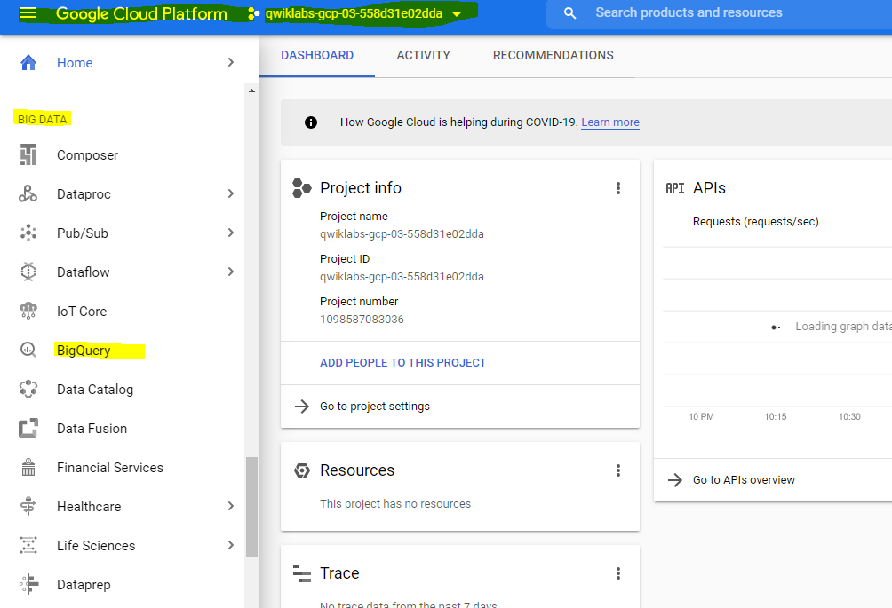
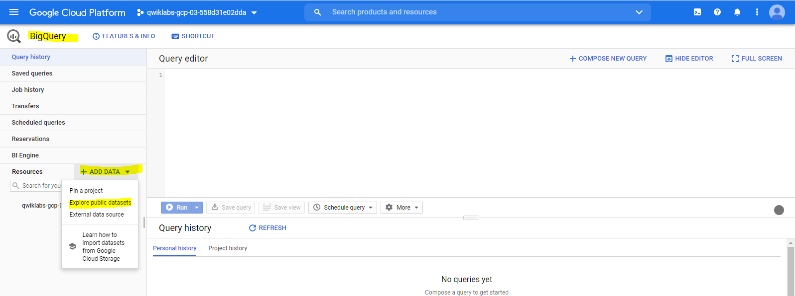
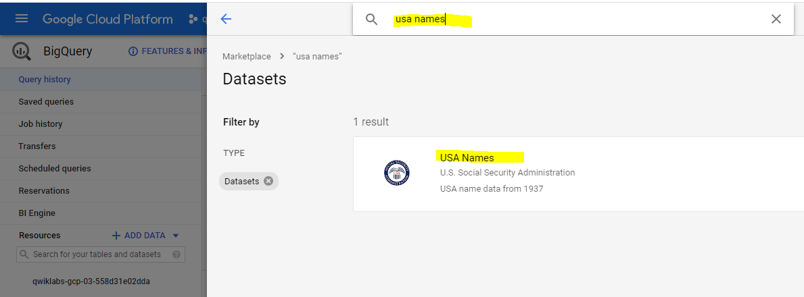
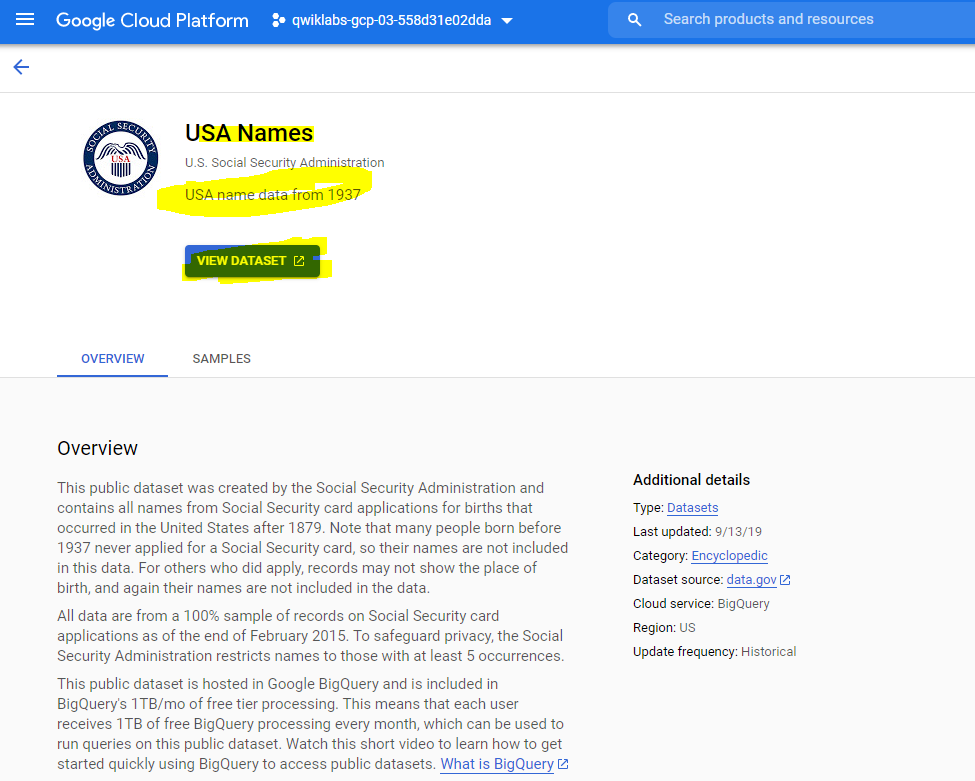
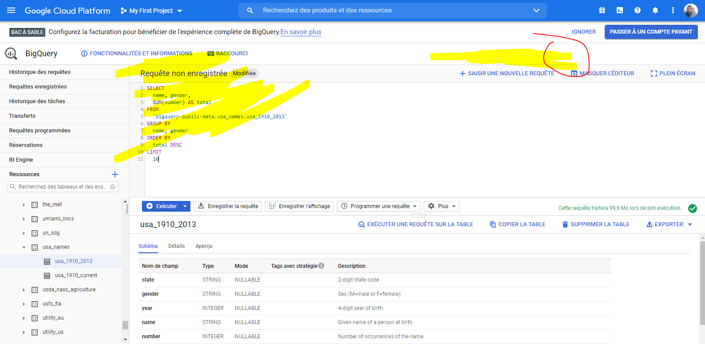
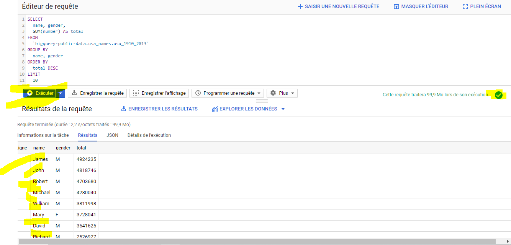
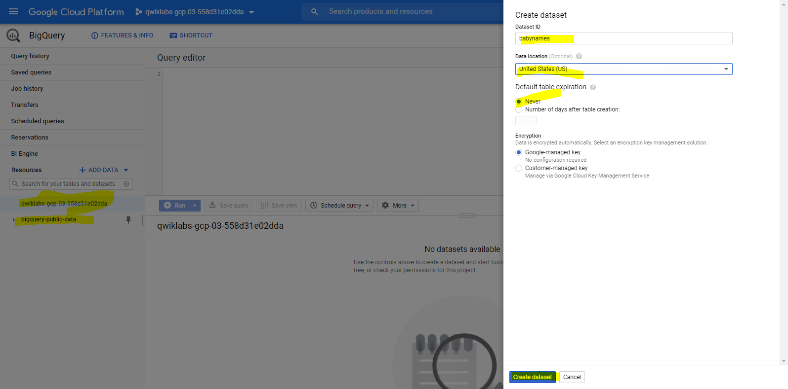
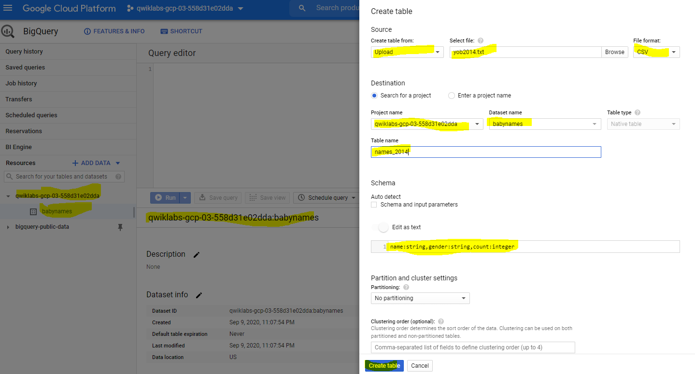
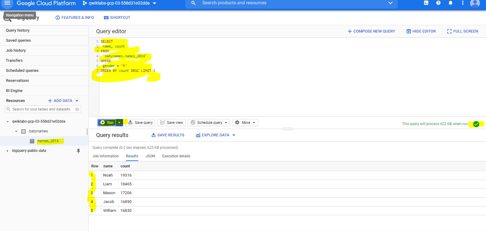
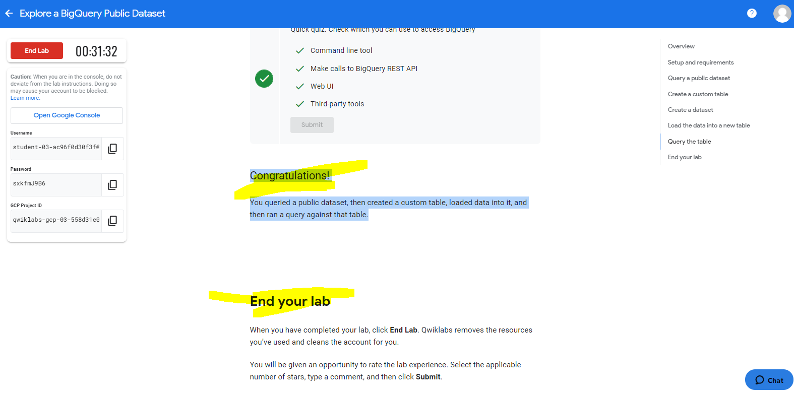

# Overview

```
Storing and querying massive datasets can be time consuming and expensive without the right hardware and infrastructure. 
Google BigQuery is an enterprise data warehouse that solves this problem by enabling super-fast SQL queries using the processing power of Google's infrastructure. 
Simply move your data into BigQuery and let us handle the hard work. You can control access to both the project and your data based on your business needs, 
such as giving others the ability to view or query your data.

You access BigQuery through the GCP Console, the command-line tool, or by making calls to the BigQuery REST API using a variety of client libraries such as Java, .NET, or Python. 
There are also a variety of third-party tools that you can use to interact with BigQuery, such as visualizing the data or loading the data. 
In this lab, you access BigQuery using the web UI.

You can use the BigQuery web UI in the GCP Console as a visual interface to complete tasks like running queries, loading data, and exporting data. 
This hands-on lab shows you how to query tables in a public dataset and how to load sample data into BigQuery through the GCP Console.

```

# Objectives 

In this lab you:

- Query a public dataset

- Create a custom table

- Load data into a table

- Query a table


# Qwiklabs setup

QwiGCP Console Ressources :


```
- Username : student-03-ac96f0d30f3f@qwiklabs.net

- Password : sxkfmJ9B6

- GCP Project ID : qwiklabs-gcp-03-558d31e02dda


```


__Open BigQuery Console__

In the Google Cloud Console, select __Navigation menu > BigQuery__
The __Welcome to BigQuery in the Cloud Console__ message box opens. This message box provides a link to the quickstart guide and lists UI updates.
Click Done.


# Query a public dataset

In this section, you load a public dataset, USA Names, into BigQuery, then query the dataset to determine the most common names in the US between 1910 and 2013.

## Load USA Name dataset

1. In the left pane, click ADD DATA > Explore public datasets.
  The Datasets window opens.

2. In the searchbox, type USA Names then Enter.

3. Click on the USA Names tile you see in the search results.

4. Click VIEW DATASET.
  BigQuery opens in a new browser tab. 
  The project bigquery-public-data is added to your resources and you see the dataset usa_names listed in the left pane in your Resources tree.


__Query the USA Name dataset__

Query bigquery-public-data.usa_names.usa_1910_2013 for the name and gender of the babies in this dataset, and then list the top 10 names in descending order.

1. Copy and paste the following query into the Query editor text area:
    ~~~~sql
    SELECT
      name, gender,
      SUM(number) AS total
    FROM
      `bigquery-public-data.usa_names.usa_1910_2013`
    GROUP BY
      name, gender
    ORDER BY
      total DESC
    LIMIT
      10
    ~~~~
 
 2. In the lower right of the window, view the query validator.
 
 BigQuery displays a green check mark icon if the query is valid. If the query is invalid, a red exclamation point icon is displayed. When the query is valid, the validator also shows the amount of data the query processes when you run it. This helps to determine the cost of running the query.

3. Click __Run.__

The query results opens below the Query editor. At the top of the Query results section, BigQuery displays the time elapsed and the data processed by the query. 
Below the time is the table that displays the query results. The header row contains the name of the column as specified in GROUP BY in the query.


## Create a custom table
In this section, you create a custom table, load data into it, and then run a query against the table.

__Download the data to your local computer__

The file you're downloading contains approximately 7 MB of data about popular baby names, and it is provided by the US Social Security Administration.

1. Download the baby names zip file to your local computer.

2. Unzip the file onto your computer.

3. The zip file contains a NationalReadMe.pdf file that describes the dataset. Learn more about the dataset.

4. Open the file named yob2014.txt to see what the data looks like. 
The file is a comma-separated value (CSV) file with the following three columns: name, sex (M or F), and number of children with that name. The file has no header row.

5. Note the location of the __yob2014.txt__ file so that you can find it later.


## Create a dataset
In this section, you create a dataset to hold your table, add data to your project, then make the data table you'll query against.

Datasets help you control access to tables and views in a project. This lab uses only one table, but you still need a dataset to hold the table.

1. Back in the console, in the left pane, in the Resources section, click your GCP Project ID (it will start with qwiklabs).
Your project opens under the Query editor.

2. On the right side in the project section, click __CREATE DATASET__

3. On the Create dataset page:

  - For __Dataset ID__, enter babynames.
  - For __Data location__, choose __United States (US)__.
  - For __Default table expiration__, leave the default value.

  Currently, the public datasets are stored in the US multi-region location. 
  For simplicity, place your dataset in the same location.

4. Click Create dataset at the bottom of the panel.

## Load the data into a new table

In this section, you load data into the table you made.

1. Click babynames found in the left pane in the Resources section, and then click Create table.
Use the default values for all settings unless otherwise indicated.

2. On the Create table page:

  - For __Source__, choose __Upload__ from the Create table from: dropdown menu.

  - For __Select file__, click __Browse_, navigate to the yob2014.txt file and click Open.

  - For File format, choose CSV from the dropdown menu.

  - For Table name, enter names_2014.

  - In the Schema section, click the Edit as text toggle and paste the following schema definition in the text box.
  
  > name:string,gender:string,count:integer

3. Click __Create table__ (at the bottom of the window).

4. Wait for BigQuery to create the table and load the data. 
  While BigQuery loads the data, a (1 running) string displays beside the Job history in the left pane. 
  The string disappears after the data is loaded.
  
__Preview the table__


1. In the left pane, select babynames > names_2014 in the navigation panel.

2. In the details panel, click the Preview tab

__QUIZ__ 

Quick quiz. You need a table to hold the dataset
    ❌True
    ✅False


## Query the table
Now that you've loaded data into your table, you can run queries against it. The process is identical to the previous example, except that this time, you're querying your table instead of a public table.

1. In the Query editor, click Compose new query.

2. Copy and paste the following query into the Query editor. This query retrieves the top 5 baby names for US males in 2014.

    ~~~~sql
    SELECT
     name, count
    FROM
     `babynames.names_2014`
    WHERE
     gender = 'M'
    ORDER BY count DESC LIMIT 5
    ~~~~
3. Click __Run__. The results are displayed below the query window.

__QUIZ__
    Quick quiz. Check which you can use to access BigQuery ( Check the Right one(s))
    
    ✅Command line tool

    ✅Make calls to BigQuery REST API

    ✅Web UI

    ✅Third-party tools


__Congratulations!__ 
You queried a public dataset, then created a custom table, loaded data into it, and then ran a query against that table.

__THE 3ND__














