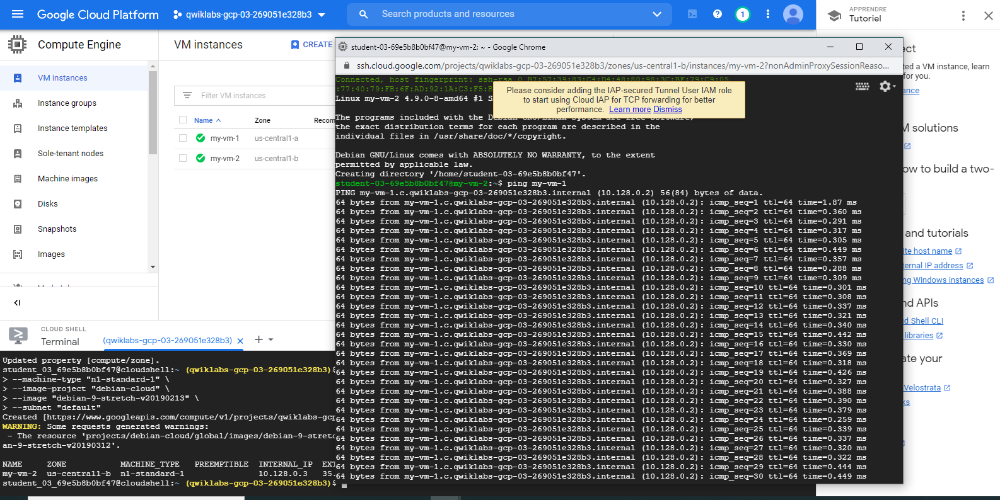
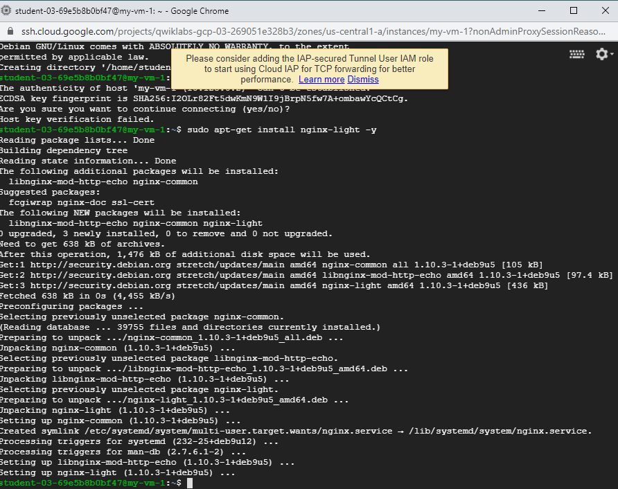
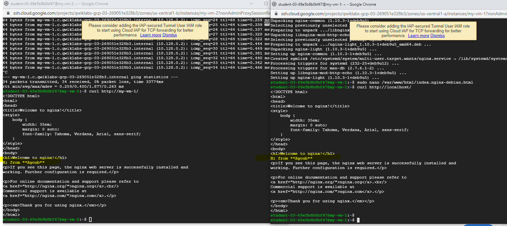
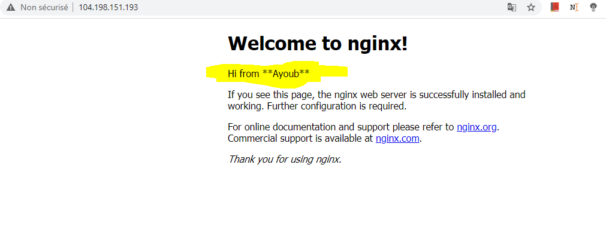
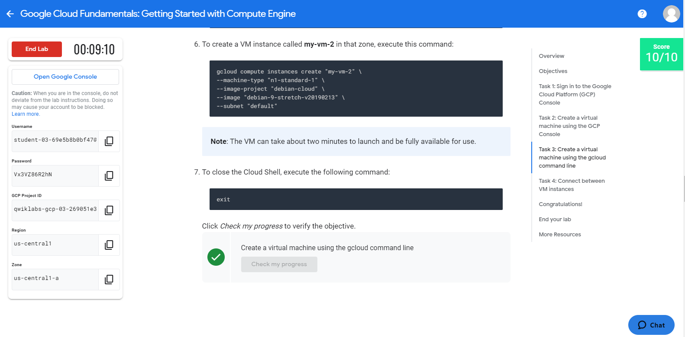

# Overview
In this lab, you will create virtual machines (VMs) and connect to them. 
You will also create connections between the instances.

# Objectives
In this lab, you will learn how to perform the following tasks:

> Create a Compute Engine virtual machine using the Google Cloud Platform (GCP) Console.

> Create a Compute Engine virtual machine using the gcloud command-line interface.

> Connect between the two instances.

## Task 1: Sign in to the Google Cloud Platform (GCP) Console

GCP Ressources : 
################################################
> Username : student-03-69e5b8b0bf47@qwiklabs.net
> Password : Vx3VZ86R2hN
> GCP Project ID : qwiklabs-gcp-03-269051e328b3
> Region : us-central1
> Zone : us-central1-a
################################################

## Task 2: Create a virtual machine using the GCP Console

1_In the Navigation menu, click Compute Engine > VM instances.
2_Click Create.
3_On the Create an Instance page, for Name, type my-vm-1
4_For Region and Zone, select the region and zone assigned by Qwiklabs.
5_For Machine type, accept the default.
6_For Boot disk, if the Image shown is not Debian GNU/Linux 9 (stretch), click Change and select Debian GNU/Linux 9 (stretch).
7_Leave the defaults for Identity and API access unmodified.
8_For Firewall, click Allow HTTP traffic.
9_Leave all other defaults unmodified.
10_To create and launch the VM, click Create.

> **Note** : The VM can take about two minutes to launch and be fully available for use.

## Task 3: Create a virtual machine using the gcloud command line

1_ In GCP console, on the top right toolbar, click the Open Cloud Shell button.  ( >_ ) 
2_ Click Continue
3_ To display a list of all the zones in the region to which Qwiklabs assigned you, 
enter this partial command gcloud compute zones list | grep followed by the region that Qwiklabs or your instructor assigned you to.
Should look like this : 
> gcloud compute zones list | grep us-central1

4_Choose a zone from that list other than the zone to which Qwiklabs assigned you. 
For example, if Qwiklabs assigned you to region us-central1 and zone us-central1-a you might choose zone us-central1-b.

5_To set your default zone to the one you just chose, enter this partial command gcloud config set compute/zone followed by the zone you chose.
Should look like this :  ( I have Zone us-central1-a , so I choose Zone -b)
> gcloud config set compute/zone us-central1-b

6_To create a VM instance called my-vm-2 in that zone, execute this command:
> gcloud compute instances create "my-vm-2" \
--machine-type "n1-standard-1" \
--image-project "debian-cloud" \
--image "debian-9-stretch-v20190213" \
--subnet "default"

**Note** : The VM can take about two minutes to launch and be fully available for use.

Then Exit.

Congrats

## Task 4: Connect between VM instances

1_In the Navigation menu, click Compute Engine > VM instances.
You will see the two VM instances you created, each in a different zone.
Notice that the Internal IP addresses of these two instances share the first three bytes in common. 
They reside on the same subnet in their Google Cloud VPC even though they are in different zones.

2_To open a command prompt on the my-vm-2 instance, click SSH in its row in the VM instances list.

3_Use the ping command to confirm that my-vm-2 can reach my-vm-1 over the network:
> ping my-vm-1
It works;

4_Use the ssh command to open a command prompt on my-vm-1:

> ssh my-vm-1
If you are prompted about whether you want to continue connecting to a host with unknown authenticity, enter yes to confirm that you do.

5At the command prompt on my-vm-1, install the Nginx web server:
> sudo apt-get install nginx-light -y

6Use the nano text editor to add a custom message to the home page of the web server:
> sudo nano /var/www/html/index.nginx-debian.html

7_e the arrow keys to move the cursor to the line just below the h1 header. Add text like this, and replace YOUR_NAME with your name:
Hi from YOUR_NAME  ( ** Ayoub **)

8_press Ctrl+O and then press Enter to save your edited file, and then press Ctrl+X to exit the nano text editor.

9_Confirm that the web server is serving your new page. At the command prompt on my-vm-1, execute this command:
> url http://localhost/
The response will be the HTML source of the web server's home page, including your line of custom text.

10_To exit the command prompt on my-vm-1, execute this command:
> exit

You will return to the command prompt on my-vm-2

11_To confirm that my-vm-2 can reach the web server on my-vm-1, at the command prompt on my-vm-2, execute this command:
> curl http://my-vm-1/
The response will again be the HTML source of the web server's home page, including your line of custom text.

12_In the Navigation menu (Navigation menu), click Compute Engine > VM instances.
Copy the External IP address for my-vm-1 and paste it into the address bar of a new browser tab. 
You will see your web server's home page, including your custom text.

