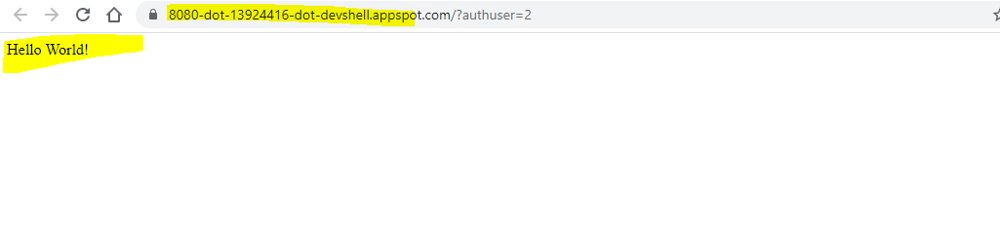
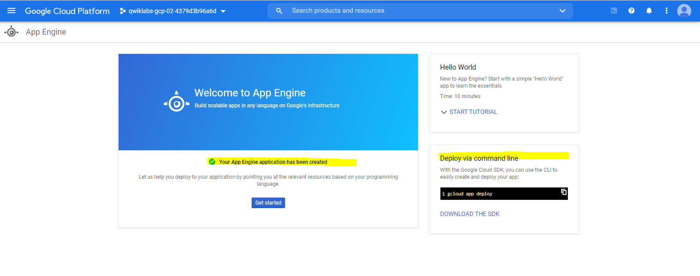
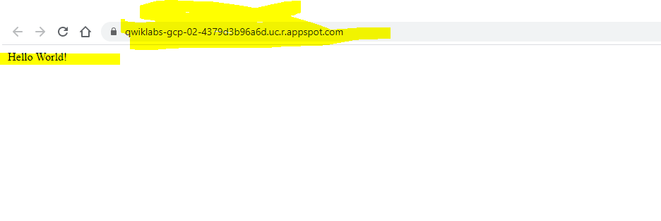
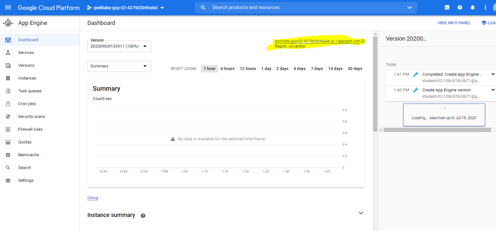
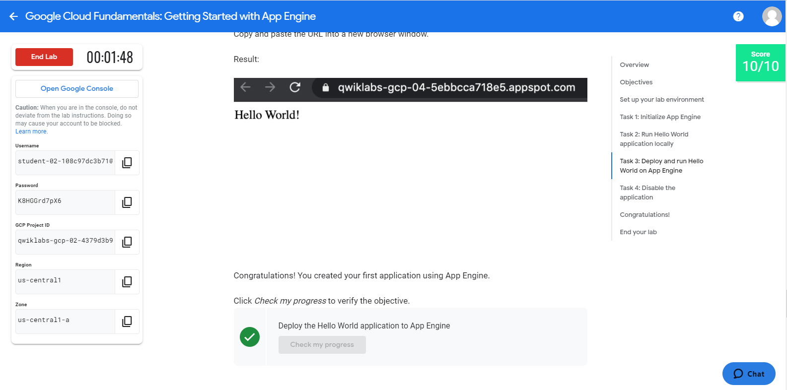

# Overview
In this lab, you create and deploy a simple App Engine application using a virtual environment in the Google Cloud Shell.

# Objectives
In this lab, you learn how to perform the following tasks:

Initialize App Engine.

Preview an App Engine application running locally in Cloud Shell.

Deploy an App Engine application, so that others can reach it.

Disable an App Engine application, when you no longer want it to be visible.

## Setup Environment 
 CGP Console Ressources :
############################################
Username
student-02-108c97dc3b71@qwiklabs.net
Password
K8HGGrd7pX6
GCP Project ID
qwiklabs-gcp-02-4379d3b96a6d
Region
us-central1
Zone
us-central1-a

############################################

**gcloud** is the command-line tool for Google Cloud Platform. It comes pre-installed on Cloud Shell and supports tab-completion.
 list the active account name with this command:
> gcloud auth list
list the project ID with this command:
> gcloud config list project

## Task 1: Initialize App Engine

1_Initialize your App Engine app with your project and choose its region:
> gcloud app create --project=$DEVSHELL_PROJECT_ID

2_Clone the source code repository for a sample application in the hello_world directory:
> git clone https://github.com/GoogleCloudPlatform/python-docs-samples

3_Navigate to the source directory:
> cd python-docs-samples/appengine/standard_python3/hello_world

## Task 2: Run Hello World application locally

1_Execute the following command to download and update the packages list.
> sudo apt-get update

2_Set up a virtual environment in which you will run your application. Python virtual environments are used to isolate package installations from the system.
> sudo apt-get install virtualenv
If prompted [Y/n], press Y and then Enter.virtualenv -p python3 venv

3_Activate the virtual environment.
> source venv/bin/activate

4_Navigate to your project directory and install dependencies.
> pip install  -r requirements.txt

5_Run the application:
> python main.py
Please ignore the warning if any.

6_In Cloud Shell, click Web preview (Web Preview) > Preview on port 8080 to preview the application.
To access the Web preview icon, you may need to collapse the Navigation menu.
(DONE)

## Task 3: Deploy and run Hello World on App Engine

1_Navigate to the source directory:
> cd ~/python-docs-samples/appengine/standard_python3/hello_world

2_Deploy your Hello World application.
> gcloud app deploy
If prompted "Do you want to continue (Y/n)?", press Y and then Enter.
This app deploy command uses the app.yaml file to identify project configuration.

3_Launch your browser to view the app at http://YOUR_PROJECT_ID.appspot.com
> gcloud app browse

(DONE)

