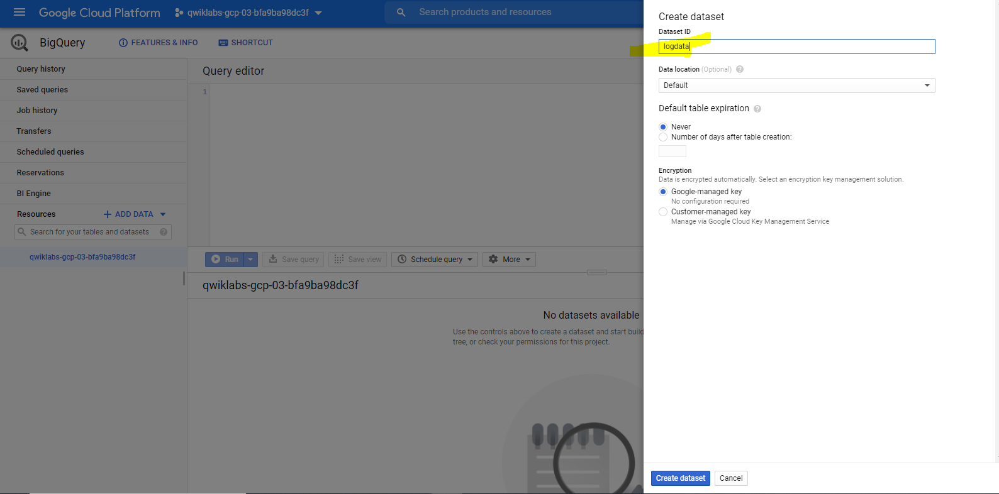
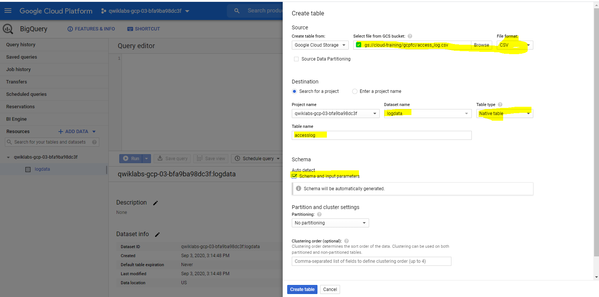
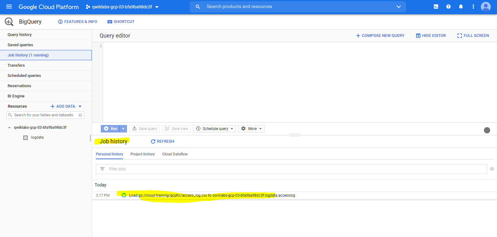
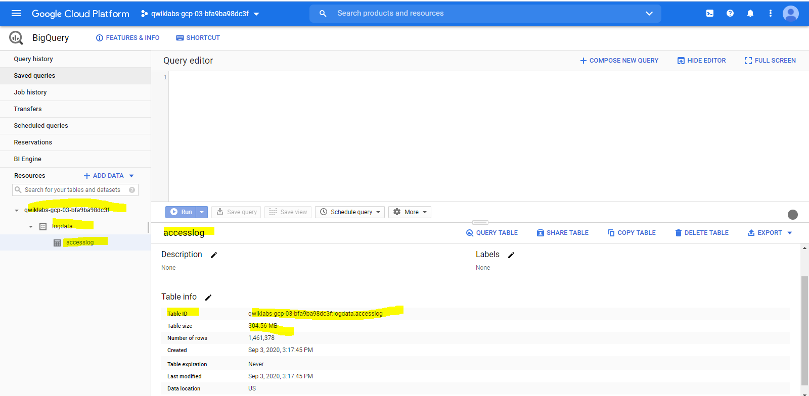
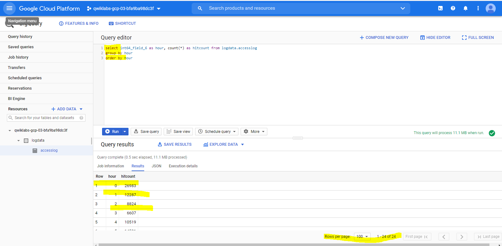
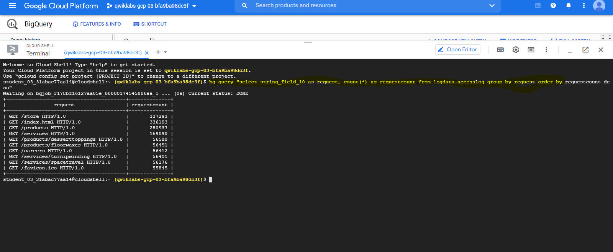
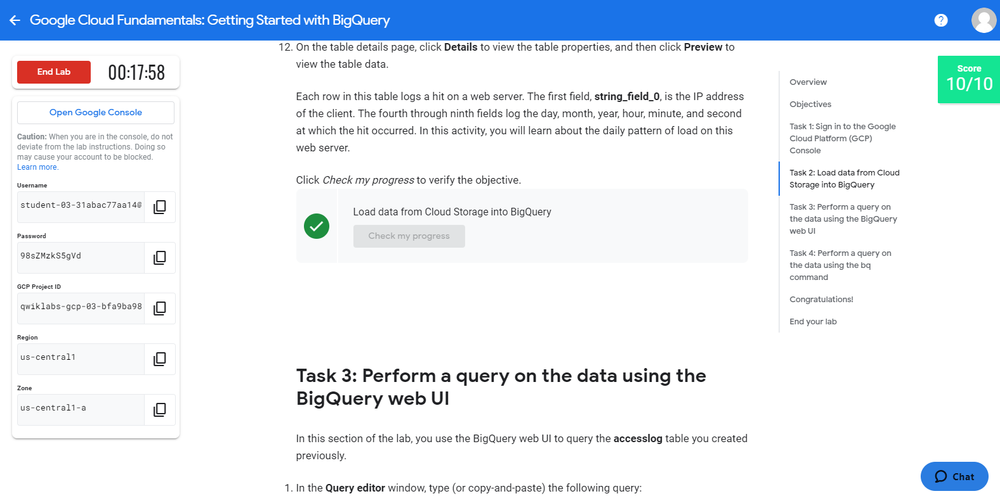
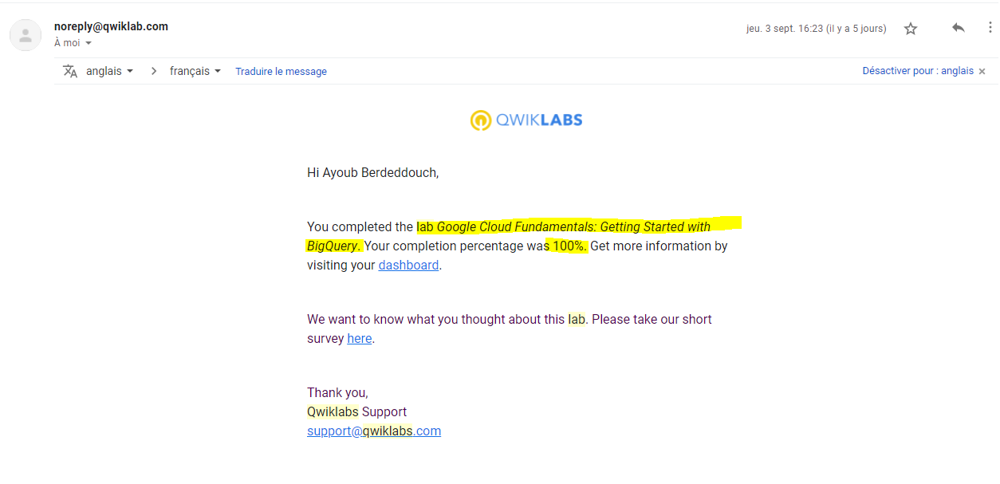

# Overview
In this lab, you load a web server log into a BigQuery table. After loading the data, you query it using the BigQuery web user interface and the BigQuery CLI.
BigQuery helps you perform interactive analysis of petabyte-scale databases, and it enables near-real time analysis of massive datasets. It offers a familiar SQL 2011 query language and functions.

Data stored in BigQuery is highly durable. Google stores your data in a replicated manner by default and at no additional charge for replicas. 
With BigQuery, you pay only for the resources you use. Data storage in BigQuery is inexpensive. 
Queries incur charges based on the amount of data they process: when you submit a query, you pay for the compute nodes only for the duration of that query. You don't have to pay to keep a compute cluster up and running.

Using BigQuery involves interacting with a number of Google Cloud Platform resources, including projects (covered elsewhere in this course), datasets, tables, and jobs. 
This lab introduces you to some of these resources, and this brief introduction summarizes their role in interacting with BigQuery.
Datasets: A dataset is a grouping mechanism that holds zero or more tables. A dataset is the lowest level unit of access control. 
Datasets are owned by GCP projects. Each dataset can be shared with individual users.
Tables: A table is a row-column structure that contains actual data. 
Each table has a schema that describes strongly typed columns of values. Each table belongs to a dataset.

# Objectives
In this lab, you learn how to perform the following tasks:

Load data from Cloud Storage into BigQuery.

Perform a query on the data in BigQuery.

## Task 1: Sign in to the Google Cloud Platform (GCP) Console
GCP Console Ressources :
##################################################
Username
student-03-31abac77aa14@qwiklabs.net

Password
98sZMzkS5gVd

GCP Project ID
qwiklabs-gcp-03-bfa9ba98dc3f

Region
us-central1

Zone
us-central1-a

##################################################

## Task 2: Load data from Cloud Storage into BigQuery
1_In the Console, on the Navigation menu click BigQuery then click Done.

2_Create a new dataset within your project by selecting your project in the Resources section, then clicking on **CREATE DATASET** on the right.

3_In the Create Dataset dialog, for Dataset ID, type logdata.

4_For Data location, select the continent closest to the region your project was created in. click Create dataset.

5_Create a new table in the logdata to store the data from the CSV file.

6_Click on Create Table. On the Create Table page, in the Source section:

 * For Create table from, choose select Google Cloud Storage, and in the field, type gs://cloud-training/gcpfci/access_log.csv.
 * Verify File format is set to CSV.

Note: When you have created a table previously, the Create from Previous Job option allows you to quickly use your settings to create similar tables.

7_In the Destination section:

 * For Dataset name, leave logdata selected.
 * For Table name, type accesslog.
 * For Table type, Native table should be selected.

8_Under Schema section, for Auto detect check the Schema and input Parameters.

9_Accept the remaining default values and click Create Table.
BigQuery creates a load job to create the table and upload data into the table (this may take a few seconds).

10_(Optional) To track job progress, click Job History.

11_When the load job is complete, click logdata > accesslog.

12_On the table details page, click Details to view the table properties, and then click Preview to view the table dselect int64_field_6 as hour, count(*) as hitcount from logdata.accesslog
group by hour
order by hourata.

Each row in this table logs a hit on a web server. The first field, string_field_0, is the IP address of the client. 
The fourth through ninth fields log the day, month, year, hour, minute, and second at which the hit occurred. 
In this activity, you will learn about the daily pattern of load on this web server.

## Task 3: Perform a query on the data using the BigQuery web UI
In this section of the lab, you use the BigQuery web UI to query the accesslog table you created previously.

1_In the Query editor window, type (or copy-and-paste) the following query:

2_Because you told BigQuery to automatically discover the schema when you load the data, 
the hour of the day during which each web hit arrived is in a field called **int_field_6**.

>select int64_field_6 as hour, count(*) as hitcount from logdata.accesslog
>group by hour
>order by hour

Notice that the Query Validator tells you that the query syntax is valid (indicated by the green check mark) 
and indicates how much data the query will process. 
The amount of data processed allows you to determine the price of the query using the Cloud Platform Pricing Calculator.

3_Click Run and examine the results. At what time of day is the website busiest? When is it least busy?

## Task 4: Perform a query on the data using the bq command
In this section of the lab, you use the bq command in Cloud Shell to query the accesslog table you created previously.

1_On the Google Cloud Platform Console, click Activate Cloud Shell Activate Cloud Shell then click Continue.

2_At the Cloud Shell prompt, enter this command:

> bq query "select string_field_10 as request, count(*) as requestcount 

> from logdata.accesslog 

> group by request 

> order by requestcount desc"

## Task 4: Perform a query on the data using the bq command
In this section of the lab, you use the bq command in Cloud Shell to query the accesslog table you created previously.

1_On the Google Cloud Platform Console, click Activate Cloud Shell Activate Cloud Shell then click Continue.

2_At the Cloud Shell prompt, enter this command:

> bq query "select string_field_10 as request, count(*) as requestcount from logdata.accesslog group by request order by requestcount desc"

