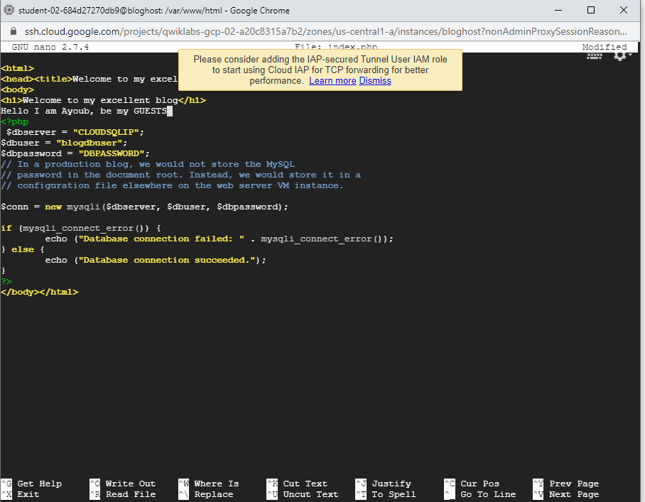
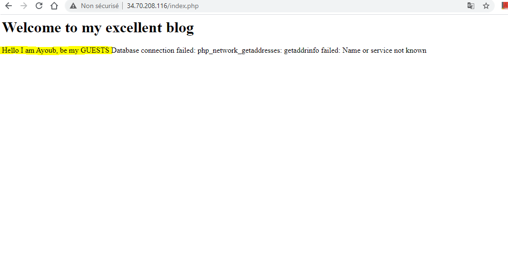
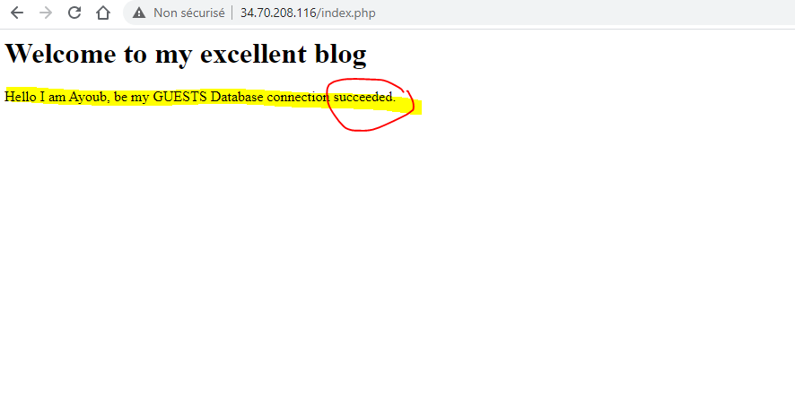
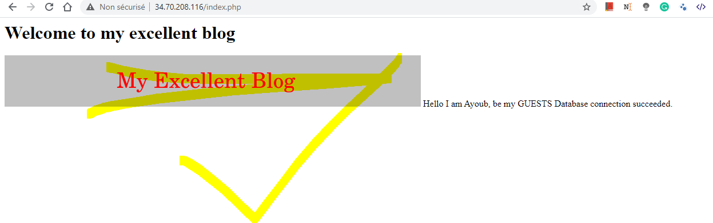
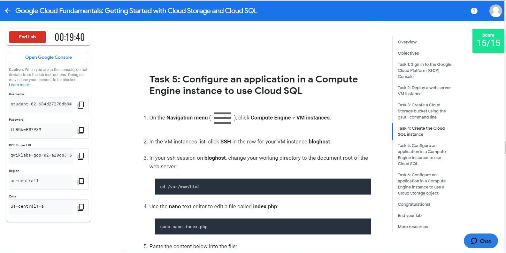
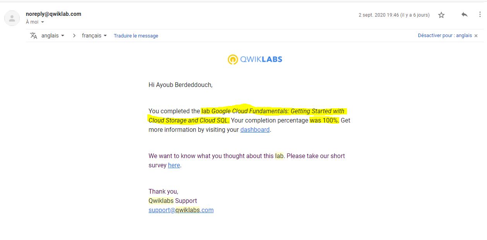

# Overview
In this lab, you create a Cloud Storage bucket and place an image in it. 
You'll also configure an application running in Compute Engine to use a database managed by Cloud SQL. 
For this lab, you will configure a web server with PHP, a web development environment that is the basis for popular blogging software. 
Outside this lab, you will use analogous techniques to configure these packages.

You also configure the web server to reference the image in the Cloud Storage bucket.

# Objectives
> In this lab, you learn how to perform the following tasks:
> Create a Cloud Storage bucket and place an image into it.
> Create a Cloud SQL instance and configure it.
> Connect to the Cloud SQL instance from a web server.
> Use the image in the Cloud Storage bucket on a web page.

## Task 1: Sign in to the Google Cloud Platform (GCP) Console

GCP Console Ressources  :

################################################
Username : student-02-684d27270db9@qwiklabs.net

Password : tLRGbwFW7P8M

GCP Project ID : qwiklabs-gcp-02-a20c8315a7b2

Region : us-central1

Zone : us-central1-a

################################################

## Task 2: Deploy a web server VM instance

1_In the GCP Console, on the Navigation menu (Navigation menu), click Compute Engine > VM instances.
2_Click Create.
3_On the Create an Instance page, for Name, type bloghost
4_For Region and Zone, select the region and zone assigned by Qwiklabs.
5_For Machine type, accept the default.
6_For Boot disk, if the Image shown is not Debian GNU/Linux 9 (stretch), click Change and select Debian GNU/Linux 9 (stretch).
7_Leave the defaults for Identity and API access unmodified.
8_ Firewall, click Allow HTTP traffic.
9_Click Management, security, disks, networking, sole tenancy to open that section of the dialog.
10_Enter the following script as the value for Startup script:
> apt-get update
apt-get install apache2 php php-mysql -y
service apache2 restart

11_ Click Create
12_ Copy bloghost VM instance's internal & external IP @ for further use.
Internal IP @ : 10.128.0.2
External IP @ : 34.70.208.116

## Task 3: Create a Cloud Storage bucket using the gsutil command line

1_On the Google Cloud Platform menu, click Activate Cloud Shell Activate Cloud Shell. If a dialog box appears, click Start Cloud Shell.

2_For convenience, enter your chosen location into an environment variable called LOCATION. Enter one of these commands:
> export LOCATION=US
or 
> export LOCATION=EU (choosed this one)
or 
> export LOCATION=ASIA

3_In Cloud Shell, the DEVSHELL_PROJECT_ID environment variable contains your project ID. Enter this command to make a bucket named after your project ID:

> gsutil mb -l $LOCATION gs://$DEVSHELL_PROJECT_ID

4_Retrieve a banner image from a publicly accessible Cloud Storage location:

> gsutil cp gs://cloud-training/gcpfci/my-excellent-blog.png my-excellent-blog.png

5_Copy the banner image to your newly created Cloud Storage bucket:

> gsutil cp my-excellent-blog.png gs://$DEVSHELL_PROJECT_ID/my-excellent-blog.png

6_Modify the Access Control List of the object you just created so that it is readable by everyone:

> gsutil acl ch -u allUsers:R gs://$DEVSHELL_PROJECT_ID/my-excellent-blog.png
DONE.

## Task 4: Create the Cloud SQL instance

1_In the GCP Console, on the Navigation menu (Navigation menu), click SQL.

2_Click Create instance.

3_For Choose a database engine, select MySQL.

4_For Instance ID, type blog-db, and for Root password( blogayoub) type a password of your choice.
5_ Set the region and zone assigned by Qwiklabs.
Region : us-central1; Zone : us-central1-a
6_ Create

7_Click on the name of the instance, blog-db, to open its details page.
8_From the SQL instances details page, copy the Public IP address for your SQL instance to a text editor for use later in this lab.
Public IP@  : 35.223.157.151
9_Click on Users menu on the left-hand side, and then click ADD USER ACCOUNT.
10_For User name, type blogdbuser
11_For Password, type a password(blogayoub) of your choice. Make a note of it.
12_Click Create to create the user account in the database.
13_ Click the Connections tab, and then click Add network.
If you are offered the choice between a Private IP connection and a Public IP connection, choose Public IP for purposes of this lab. The Private IP feature is in beta at the time this lab was written.
The Add network button may be grayed out if the user account creation is not yet complete.

14_For Name, type web front end
For Network, type the external IP address of your bloghost VM instance, followed by /32
The result will look like this:
 34.70.208.116/32
Be sure to use the external IP address of your VM instance followed by /32. Do not use the VM instance's internal IP address. Do not use the sample IP address shown here.

15_Click Done to finish defining the authorized network.
16_Click Save to save the configuration change
DONE

## Task 5: Configure an application in a Compute Engine instance to use Cloud SQL

On the Navigation menu (Navigation menu), click Compute Engine > VM instances.

In the VM instances list, click SSH in the row for your VM instance bloghost.

In your ssh session on bloghost, change your working directory to the document root of the web server:

> cd /var/www/html

Use the nano text editor to edit a file called index.php:
> sudo nano index.php

Paste the content below into the file:
#<html>
#<head><title>Welcome to my excellent blog</title></head>
#<body>
#<h1>Welcome to my excellent blog</h1>
#<?php
#$dbserver = "CLOUDSQLIP";
#$dbuser = "blogdbuser";
#$dbpassword = "DBPASSWORD";
#// In a production blog, we would not store the MySQL
#// password in the document root. Instead, we would store it in a
#// configuration file elsewhere on the web server VM instance.
#$conn = new mysqli($dbserver, $dbuser, $dbpassword);
#if (mysqli_connect_error()) {
#        echo ("Database connection failed: " . mysqli_connect_error());
#} else {
#         echo ("Database connection succeeded.");
#}
#?>
#</body>
#</html>

Press Ctrl+O, and then press Enter to save your edited file.
Press Ctrl+X to exit the nano text editor.
Restart the web server:
> sudo service apache2 restart
Open a new web browser tab and paste into the address bar your bloghost VM instance's external IP address followed by /index.php. The URL will look like this:
> ##http://34.70.208.116/index.php

When you load the page, you will see that its content includes an error message beginning with the words:
** Database connection failed: ...**
This message occurs because you have not yet configured PHP's connection to your Cloud SQL instance.
Return to your ssh session on bloghost. Use the nano text editor to edit index.php again.
> sudo nano index.php

In the nano text editor, replace CLOUDSQLIP = 35.223.157.151 with the Cloud SQL instance Public IP address that you noted above. Leave the quotation marks around the value in place.
In the nano text editor, replace DBPASSWORD = blogayoub with the Cloud SQL database password that you defined above. Leave the quotation marks around the value in place.
Press Ctrl+O, and then press Enter to save your edited file.
Press Ctrl+X to exit the nano text editor.
Restart the web server:

> sudo service apache2 restart

Return to the web browser tab in which you opened your bloghost VM instance's external IP address. When you load the page, the following message appears:

Database connection succeeded.

DONE

## Task 6: Configure an application in a Compute Engine instance to use a Cloud Storage object

Add the image.
In the GCP Console, click Storage > Browser.

Click on the bucket that is named after your GCP project.

In this bucket, there is an object called my-excellent-blog.png. Copy the URL behind the link icon that appears in that object's Public access column, or behind the words "Public link" if shown.

If you see neither a link icon nor a "Public link", try refreshing the browser. If you still do not see a link icon, return to Cloud Shell and confirm that your attempt to change the object's Access Control list with the gsutil acl ch command was successful.

Return to your ssh session on your bloghost VM instance.

Enter this command to set your working directory to the document root of the web server:
> cd /var/www/html

Use the nano text editor to edit index.php:
> sudo nano index.php

Use the arrow keys to move the cursor to the line that contains the h1 element. Press Enter to open up a new, blank screen line, and then paste the URL you copied earlier into the line.

Paste this HTML markup immediately before the URL:

> <#img src='Place a closing single quotation mark and a closing angle bracket at the end of the URL:'>

The resulting line will look like this:

> <#img src='https://storage.googleapis.com/qwiklabs-gcp-0005e186fa559a09/my-excellent-blog.png'>

The effect of these steps is to place the line containing §<#img src='...'> immediately before the line containing <#h1>...</h1>

Do not copy the URL shown here. Instead, copy the URL shown by the Storage browser in your own Cloud Platform project.
Press Ctrl+O, and then press Enter to save your edited file.
Press Ctrl+X to exit the nano text editor.
Restart the web server:
> sudo service apache2 restart
Return to the web browser tab in which you opened your bloghost VM instance's external IP address. When you load the page, its content now includes a banner image

################################################################

