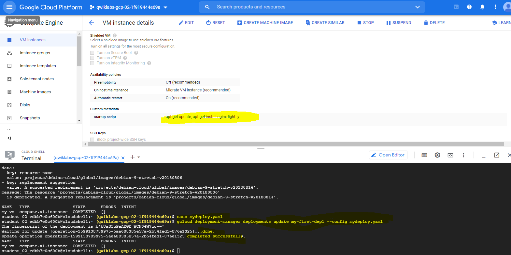

# Overview
In this lab, you create a deployment using Deployment Manager and use it to maintain a consistent state of your deployment. You will also view resource usage in a VM instance using Cloud Monitoring.

# Objectives
In this lab, you will learn how to perform the following tasks:

Create a Deployment Manager deployment.

Update a Deployment Manager deployment.

View the load on a VM instance using Cloud Monitoring.

## Task 1: Sign in to the Google Cloud Platform (GCP) Console
GCP Console Ressources
############################################

############################################

## Task 2: Confirm that needed APIs are enabled
Make a note of the name of your GCP project. This value is shown in the top bar of the Google Cloud Platform Console. It will be of the form qwiklabs-gcp- followed by hexadecimal numbers.

In the GCP Console, on the Navigation menu (Navigation menu), click APIs & services.

Scroll down in the list of enabled APIs, and confirm that these APIs are enabled:

Cloud Deployment Manager v2 API

Cloud Runtime Configuration API

Cloud Monitoring API

If one or more APIs is missing, click the Enable APIs and Services button at top. 
Search for the above APIs by name and enable each for your current project. (You noted the name of your GCP project above.)

## Task 3: Create a Deployment Manager deployment
1_In GCP console, on the top right toolbar, click the Open Cloud Shell button(>_) (Activate Cloud Shell). Click Continue.

2_For your convenience, place the zone that Qwiklabs assigned you to into an environment variable called MY_ZONE. At the Cloud Shell prompt, type this partial command:
> export MY_ZONE=
followed by the zone that Qwiklabs assigned you to. Your complete command will look similar to this:
> export MY_ZONE=us-central1-a

3_At the Cloud Shell prompt, download an editable Deployment Manager template:
> gsutil cp gs://cloud-training/gcpfcoreinfra/mydeploy.yaml mydeploy.yaml

4_In the Cloud Shell, use the sed command to replace the PROJECT_ID placeholder string with your Google Cloud Platform project ID using this command:
> sed -i -e "s/PROJECT_ID/$DEVSHELL_PROJECT_ID/" mydeploy.yaml

5_In the Cloud Shell, use the sed command to replace the ZONE placeholder string with your Google Cloud Platform zone using this command:
> sed -i -e "s/ZONE/$MY_ZONE/" mydeploy.yaml

6_View the mydeploy.yaml file, with your modifications, with this command:
> cat mydeploy.yaml
The  YAML file look like : 

> 

7_Build a deployment from the template:
> gcloud deployment-manager deployments create my-first-depl --config mydeploy.yaml
When the deployment operation is complete, the gcloud command displays a list of the resources named in the template and their current state.

8_Confirm that the deployment was successful. 
In the GCP Console, on the Navigation menu (Navigation menu), click Compute Engine > VM instances. 
You will see that a VM instance called my-vm has been created, as specified by the template.

9_Click on the VM instance's name to open its VM instance details screen.
10_Scroll down to the Custom metadata section. 
Confirm that the startup script you specified in your Deployment Manager template has been installed.

## Task 4: Update a Deployment Manager deployment

1_Return to your Cloud Shell prompt. Launch the nano text editor to edit the mydeploy.yaml file:

> nano mydeploy.yaml

2_Find the line that sets the value of the startup script, value: "apt-get update", and edit it so that it looks like this:

>      value: "apt-get update; apt-get install nginx-light -y"

3_Press Ctrl+O and then press Enter to save your edited file.

4_Press Ctrl+X to exit the nano text editor.

5_Return to your Cloud Shell prompt. Enter this command to cause Deployment Manager to update your deployment to install the new startup script:

> gcloud deployment-manager deployments update my-first-depl --config mydeploy.yaml
Wait for the gcloud command to display a message confirming that the update operation was completed successfully.

6_In the GCP console, on the Navigation menu (Navigation menu), click Compute Engine > VM instances.
7_Click on the my-vm VM instance's name to open its VM instance details pane.
8_Scroll down to the Custom metadata section. Confirm that the startup script has been updated to the value you declared in your Deployment Manager template.

## Task 5: View the Load on a VM using Cloud Monitoring

1_In the GCP Console, on the Navigation menu (Navigation menu), click Compute Engine > VM instances.

2_To open a command prompt on the my-vm instance, click SSH in its row in the VM instances list.

3_In the ssh session on my-vm, execute this command to create a CPU load:

> dd if=/dev/urandom | gzip -9 >> /dev/null &
This Linux pipeline forces the CPU to work on compressing a continuous stream of random data.
Leave the window containing your SSH session open while you proceed with the lab.

Create a Monitoring workspace
You will now setup a Monitoring workspace that's tied to your Qwiklabs GCP Project. The following steps create a new account that has a free trial of Monitoring.
In the Google Cloud Platform Console, click on Navigation menu > Monitoring.
Wait for your workspace to be provisioned.

Click on Settings option from the left panel and confirm that the GCP project which Qwiklabs created for you is shown under the GCP Projects section.
Under the Settings tab menu, click Agent. Using your VM's open SSH window and the code shown on the Agents page, install both the Monitoring and Logging agents on your project's VM.

Once both of the agents have been installed on your project's VM, click Metrics Explorer under the main Cloud Monitoring menu on the far left.
In the Metric pane of Metrics Explorer, select the resource type GCE VM instance and the metric CPU usage.
In the resulting graph, notice that CPU usage increased sharply a few minutes ago.
Terminate your workload generator. Return to your ssh session on my-vm and enter this command:

> kill %1

