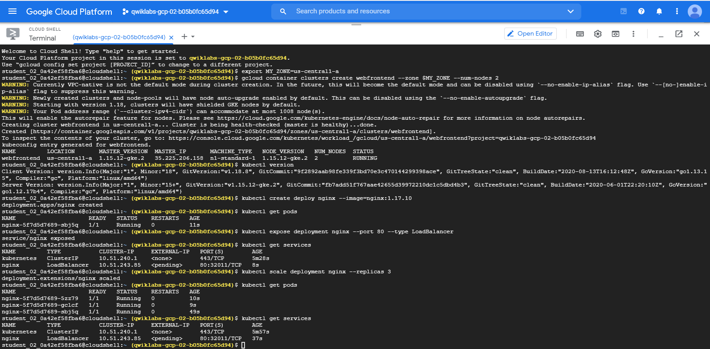
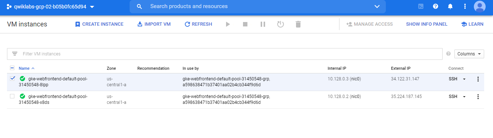
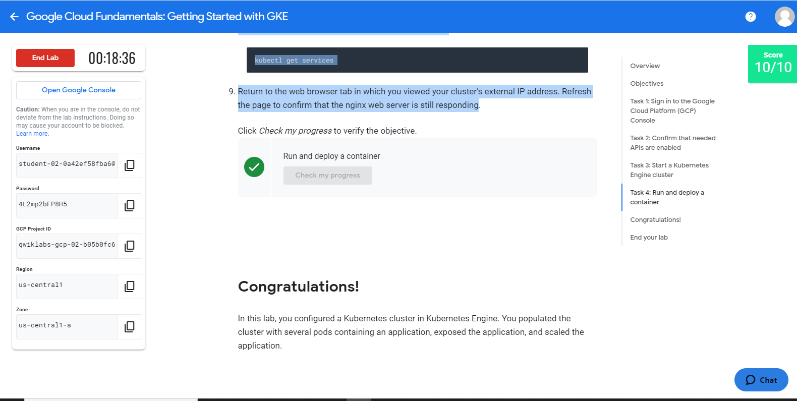
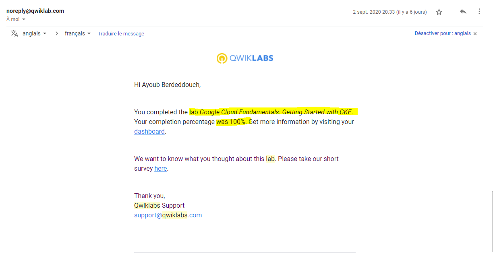

# Overview
In this lab, you create a Google Kubernetes Engine cluster containing several containers, each containing a web server. You place a load balancer in front of the cluster and view its contents.

# Objectives
In this lab, you learn how to perform the following tasks:

Provision a Kubernetes cluster using Kubernetes Engine.

Deploy and manage Docker containers using kubectl.

## Task 1: Sign in to the Google Cloud Platform (GCP) Console

GCP Console Ressources  : 

###################################
Username
student-02-0a42ef58fba6@qwiklabs.net
Password
4L2mp2bFP8H5
GCP Project ID
qwiklabs-gcp-02-b05b0fc65d94
Region
us-central1
Zone
us-central1-a

######################################

## Task 2: Confirm that needed APIs are enabled
Make a note of the name of your GCP project. This value is shown in the top bar of the Google Cloud Platform Console. 
It will be of the form qwiklabs-gcp- followed by hexadecimal numbers.
In the GCP Console, on the Navigation menu (Navigation menu), click APIs & Services.
Scroll down in the list of enabled APIs, and confirm that both of these APIs are enabled:

Kubernetes Engine API
Container Registry API

If either API is missing, click Enable APIs and Services at the top. 
Search for the above APIs by name and enable each for your current project. (You noted the name of your GCP project above.)

## Task 3: Start a Kubernetes Engine cluster
1_In GCP console, on the top right toolbar, click the Open Cloud Shell button. (>_)
2_Click Continue.

3_For convenience, place the zone that Qwiklabs assigned you to into an environment variable called MY_ZONE. 
At the Cloud Shell prompt, type this partial command:

> export MY_ZONE=

followed by the zone that Qwiklabs assigned to you. Your complete command will look similar to this:

> export MY_ZONE=us-central1-a

4_ Start a Kubernetes cluster managed by Kubernetes Engine. Name the cluster webfrontend and configure it to run 2 nodes:

> gcloud container clusters create webfrontend --zone $MY_ZONE --num-nodes 2

It takes several minutes to create a cluster as Kubernetes Engine provisions virtual machines for you.

5_After the cluster is created, check your installed version of Kubernetes using the kubectl version command:

> kubectl version

The gcloud container clusters create command automatically authenticated kubectl for you.

## Task 4: Run and deploy a container

1_From your Cloud Shell prompt, launch a single instance of the nginx container. (Nginx is a popular web server.)
> kubectl create deploy nginx --image=nginx:1.17.10

2_View the pod running the nginx container:

> kubectl get pods

Expose the nginx container to the Internet:

> kubectl expose deployment nginx --port 80 --type LoadBalancer

Kubernetes created a service and an external load balancer with a public IP address attached to it. The IP address remains the same for the life of the service. Any network traffic to that public IP address is routed to pods behind the service: in this case, the nginx pod.

View the new service:

> kubectl get services

You can use the displayed external IP address to test and contact the nginx container remotely.

It may take a few seconds before the External-IP field is populated for your service. This is normal. Just re-run the kubectl get services command every few seconds until the field is populated.

Open a new web browser tab and paste your cluster's external IP address into the address bar. The default home page of the Nginx browser is displayed.

Scale up the number of pods running on your service:

> kubectl scale deployment nginx --replicas 3

Scaling up a deployment is useful when you want to increase available resources for an application that is becoming more popular.

Confirm that Kubernetes has updated the number of pods:

> kubectl get pods

Confirm that your external IP address has not changed:

> kubectl get services

Return to the web browser tab in which you viewed your cluster's external IP address. Refresh the page to confirm that the nginx web server is still responding.

DONE

