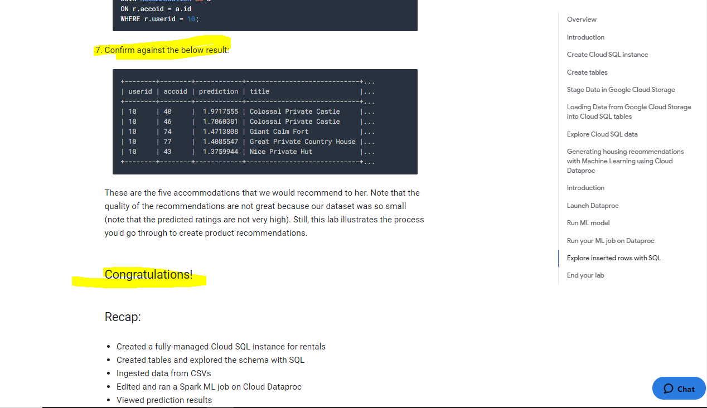
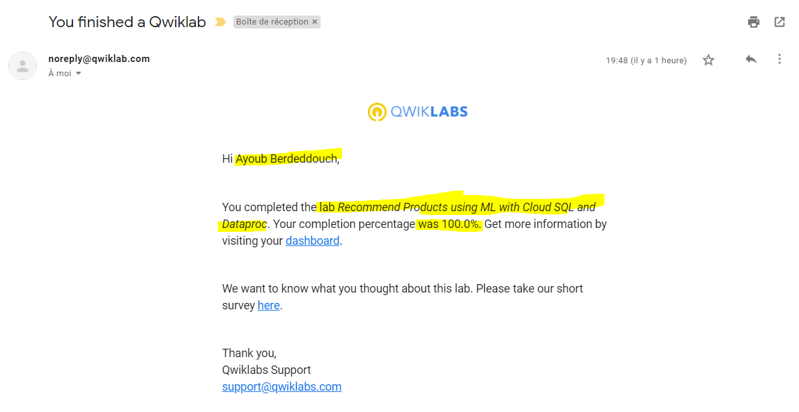

# Overview
In this lab, you populate rentals data in Cloud SQL for the rentals recommendation engine to use.

# Objectives 

In this lab, you will:

- Create Cloud SQL instance

- Create database tables by importing .sql files from Cloud Storage

- Populate the tables by importing .csv files from Cloud Storage

- Allow access to Cloud SQL

- Explore the rentals data using SQL statements from CloudShell

# Qwiklabs setup

GCP Console Ressources: 

```

```


# Introduction

In this lab, you populate rentals data in Cloud SQL for the rentals recommendation engine to use. 
The recommendations engine itself will run on Dataproc using Spark ML.

# Create Cloud SQL instance

1. In the Console, click Navigation menu > SQL (in the Storage section).

2. Click Create instance.

3. Choose MySQL. Click Next if required.

4. For Instance ID, type rentals.

5. Scroll down and specify a root password. Before you forget, note down the root password.

6. Click Create to create the instance. It will take a minute or so for your Cloud SQL instance to be provisioned.

# Create tables

1. While you wait for your instance to be created, read the below mySQL script and answer the questions that follow below

~~~~sql
    CREATE DATABASE IF NOT EXISTS recommendation_spark;

    USE recommendation_spark;

    DROP TABLE IF EXISTS Recommendation;
    DROP TABLE IF EXISTS Rating;
    DROP TABLE IF EXISTS Accommodation;

    CREATE TABLE IF NOT EXISTS Accommodation
    (
      id varchar(255),
      title varchar(255),
      location varchar(255),
      price int,
      rooms int,
      rating float,
      type varchar(255),
      PRIMARY KEY (ID)
    );

    CREATE TABLE  IF NOT EXISTS Rating
    (
      userId varchar(255),
      accoId varchar(255),
      rating int,
      PRIMARY KEY(accoId, userId),
      FOREIGN KEY (accoId)
        REFERENCES Accommodation(id)
    );

    CREATE TABLE  IF NOT EXISTS Recommendation
    (
      userId varchar(255),
      accoId varchar(255),
      prediction float,
      PRIMARY KEY(userId, accoId),
      FOREIGN KEY (accoId)
        REFERENCES Accommodation(id)
    );

    SHOW DATABASES;
~~~~

__QUIZ__

    How many tables will this script create?

    2

    3

    1


__QUIZ__ 

    When a user rates a house (giving it four stars for example), 
    an entry is added to the _______ table.

    Recommendation

    Rating

    Accommodation
    
__QUIZ__

    General information about houses, such as the number of rooms they have 
    and their average rating is stored in the _________ table.

    Recommendation

    Rating

    Accommodation

__QUIZ__

    The job of the recommendation engine is to fill out the ___________ table for 
    each user and house: this is the predicted rating of that house by that user.

    Recommendation

    Rating

    Accommodation

2. In Cloud __SQL__, click rentals to view instance information.

__Connect to the database__

3. Find the Connect to this instance box on the page and click on connect using Cloud Shell
  ```
  Note: You could also connect to your instance from a dedicated Cloud Compute Engine VM 
  but for now we'll have Cloud Shell create a micro-VM for us and operate from there.
  ```
4. Wait for Cloud Shell to load

5. Once Cloud Shell loads, you will see the below command already typed:

   ``` gcloud sql connect rentals --user=root --quiet```
   
6. Hit Enter

7. Wait for your IP Address to be whitelisted
  ```Whitelisting your IP for incoming connection for 5 minutes...⠹```
  
8. When prompted, enter your password and hit Enter (note: you will not see your password typed in or even ****)
    You can now run commands against your database!

9. Run the below command
    ``` SHOW DATABASES; ```
    
    You should see the default system databases:
    
    ```
    +--------------------+
    | Database           |
    +--------------------+
    | information_schema |
    | mysql              |
    | performance_schema |
    | sys                |
    +--------------------+
    ```
    
    Note: You must always end your mySQL commands with a semi-colon ```;```
10. Copy and paste the below SQL statement you analyzed earlier paste it into the command line
      ~~~~sql
      CREATE DATABASE IF NOT EXISTS recommendation_spark;

      USE recommendation_spark;

      DROP TABLE IF EXISTS Recommendation;
      DROP TABLE IF EXISTS Rating;
      DROP TABLE IF EXISTS Accommodation;

      CREATE TABLE IF NOT EXISTS Accommodation
      (
        id varchar(255),
        title varchar(255),
        location varchar(255),
        price int,
        rooms int,
        rating float,
        type varchar(255),
        PRIMARY KEY (ID)
      );

      CREATE TABLE  IF NOT EXISTS Rating
      (
        userId varchar(255),
        accoId varchar(255),
        rating int,
        PRIMARY KEY(accoId, userId),
        FOREIGN KEY (accoId)
          REFERENCES Accommodation(id)
      );

      CREATE TABLE  IF NOT EXISTS Recommendation
      (
        userId varchar(255),
        accoId varchar(255),
        prediction float,
        PRIMARY KEY(userId, accoId),
        FOREIGN KEY (accoId)
          REFERENCES Accommodation(id)
      );

      SHOW DATABASES;
      ~~~~

11. Hit Enter

12. Confirm you see recommendation_spark as a database now:
      ```
      +----------------------+
      | Database             |
      +----------------------+
      | information_schema   |
      | mysql                |
      | performance_schema   |
      | recommendation_spark |
      | sys                  |
      +----------------------+
      ```

13. Run the following command to show our tables
      ~~~~sql
      USE recommendation_spark;

      SHOW TABLES;
      ~~~~

14. Hit Enter

15. Confim you see the three tables:
      ```
      +--------------------------------+
      | Tables_in_recommendation_spark |
      +--------------------------------+
      | Accommodation                  |
      | Rating                         |
      | Recommendation                 |
      +--------------------------------+
      ```

16. Run the following query
  ~~~~sql
  SELECT * FROM Accommodation;
  ~~~~
  
__QUIZ__ 

    How many rows are in the Accommodation table?

    Empty set (0)

    100

    1,000


## Stage Data in Google Cloud Storage

__Option 1: Use Command Line__

1. Open a new Cloud Shell tab (do not use your existing mySQL Cloud Shell tab)

2. Paste in the below command

        ```
        echo "Creating bucket: gs://$DEVSHELL_PROJECT_ID"
        gsutil mb gs://$DEVSHELL_PROJECT_ID

        echo "Copying data to our storage from public dataset"
        gsutil cp gs://cloud-training/bdml/v2.0/data/accommodation.csv gs://$DEVSHELL_PROJECT_ID
        gsutil cp gs://cloud-training/bdml/v2.0/data/rating.csv gs://$DEVSHELL_PROJECT_ID

        echo "Show the files in our bucket"
        gsutil ls gs://$DEVSHELL_PROJECT_ID

        echo "View some sample data"
        gsutil cat gs://$DEVSHELL_PROJECT_ID/accommodation.csv
        ```
3. Hit ENTER.

__Option 2: Use Console UI__

Skip these steps if you already have loaded your data using the command line

1. Navigate to Storage and select Storage > Browser

2. Click Create Bucket (if one does not already exist)

3. Specify your project name as the bucket name

4. Click Create

5. Download the below files locally and then upload them inside of your new bucket:

        - accommodation.csv

        - rating.csv


## Loading Data from Google Cloud Storage into Cloud SQL tables

1. Navigate back to SQL

2. Click on rentals

__Import accommodation data__

1. Click Import (top menu).

2. Specify the following:

        - Cloud Storage file: Browse to select accommodation.csv

        - Format of import: CSV

        - Database: select recommendation_spark from the drop down

        - Table: copy and paste: Accommodation

3. Click Import

4. You will be redirected back to the Overview page. Wait one minute for the data to load.

__Import user rating data__

1. Click Import (top menu).

2. Specify the following:

        - Cloud Storage file: Browse to select rating.csv

        - Format of import: CSV

        - Database: select recommendation_spark from the drop down

        - Table: copy and paste: Rating

3. Click Import

4. You will be redirected back to the Overview page. Wait one minute for the data to load.

## Explore Cloud SQL data

1. If you closed your Cloud Shell connection to mySQL, open it again by finding Connect to this instance and clicking Connect using Cloud Shell

2. Hit enter when prompted to login

3. Provide your password and hit enter

4. Query the ratings data:

        ~~~~~sql
        USE recommendation_spark;

        SELECT * FROM Rating
        LIMIT 15;
        ~~~~~

5. Use a SQL aggregation function to count the number of rows in the table

        ~~~~~sql
        SELECT COUNT(*) AS num_ratings
        FROM Rating;
        ~~~~~

__QUIZ__

        How many ratings do we have in our table?

        1186

        100,000

        5,203

6. What's the average review of our accommodations?

        ~~~~~sql
        SELECT
            COUNT(userId) AS num_ratings,
            COUNT(DISTINCT userId) AS distinct_user_ratings,
            MIN(rating) AS worst_rating,
            MAX(rating) AS best_rating,
            AVG(rating) AS avg_rating
        FROM Rating;
        ~~~~~
        
__QUIZ__

        What is the average rating across all reviews?

        2.46

        5.0

        4.51

__QUIZ__

        What does the 25 for distinct_user_ratings mean?

        There are 25 unique users who provided the ratings

        There are 25 ratings per accommodation

        There are 25 ratings per user
        
In machine learning, we will need a rich history of user preferences for the model to learn from. Run the below query to see which users have provided the most ratings

        ~~~~~sql
        SELECT
            userId,
            COUNT(rating) AS num_ratings
        FROM Rating
        GROUP BY userId
        ORDER BY num_ratings DESC;
        ~~~~~
        
__QUIZ__

        How many reviews did the top user leave?

        75

        50

        100

7. You may exit the mysql prompt by typing exit.

# Generating housing recommendations with Machine Learning using Cloud Dataproc

In this lab, you carry out recommendations machine learning using Dataproc.

__What you learn__

In this lab, you will:

    - Launch Dataproc

    - Run SparkML jobs using Dataproc
    
    
## Introduction
In this lab, you use Dataproc to train the recommendations machine learning model based on users' previous ratings. You then apply that model to create a list of recommendations for every user in the database.

In this lab, you will:

    - Launch Dataproc

    - Train and apply ML model written in PySpark to create product recommendations

    - Explore inserted rows in Cloud SQL

## Launch Dataproc

To launch Dataproc and configure it so that each of the machines in the cluster can access Cloud SQL:

1. In the GCP Console, on the Navigation menu , click SQL and note the region of your Cloud SQL instance:

        In the snapshot above, the region is us-central1.

2. In the GCP Console, on the Navigation menu (Navigation menu), click Dataproc and click Enable API if prompted.

3. Once enabled, click Create cluster and name your cluster rentals

4. Select Region as global and change the Zone to us-central1-a (in the same zone as your Cloud SQL instance). This will minimize network latency between the cluster and the database.

5. For Master node, for Machine type, select 2 vCPUs (n1-standard-2).

6. For Worker nodes, for Machine type, select 2 vCPUs (n1-standard-2).

7. Leave all other values with their default and click Create. It will take 1-2 minutes to provision your cluster.

8. Note the Name, Zone and Total worker nodes in your cluster.

9. Copy and paste the below bash script into your Cloud Shell (optionally change CLUSTER, ZONE, NWORKERS if necessary before running)

```sh
echo "Authorizing Cloud Dataproc to connect with Cloud SQL"
CLUSTER=rentals
CLOUDSQL=rentals
ZONE=us-central1-a
NWORKERS=2

machines="$CLUSTER-m"
for w in `seq 0 $(($NWORKERS - 1))`; do
   machines="$machines $CLUSTER-w-$w"
done

echo "Machines to authorize: $machines in $ZONE ... finding their IP addresses"
ips=""
for machine in $machines; do
    IP_ADDRESS=$(gcloud compute instances describe $machine --zone=$ZONE --format='value(networkInterfaces.accessConfigs[].natIP)' | sed "s/\['//g" | sed "s/'\]//g" )/32
    echo "IP address of $machine is $IP_ADDRESS"
    if [ -z  $ips ]; then
       ips=$IP_ADDRESS
    else
       ips="$ips,$IP_ADDRESS"
    fi
done

echo "Authorizing [$ips] to access cloudsql=$CLOUDSQL"
gcloud sql instances patch $CLOUDSQL --authorized-networks $ips

```

10. Hit enter then, when prompted, type Y, then enter again to continue

11. Wait for the patching to complete. You will see
        ``` Patching Cloud SQL instance...done. ```
        
12. Lastly, on the main Cloud SQL page, under Connect to this instance copy your Public IP Address to your clipboard (or write it down, we're using it next)


## Run ML model
To create a trained model and apply it to all the users in the system:

Your data science team has created a recommendation model using Apache Spark and written in Python. Let's copy it over into our staging bucket.

1. Copy over the model code by executing the below in Cloud Shell

        ```sh
        gsutil cp gs://cloud-training/bdml/v2.0/model/train_and_apply.py train_and_apply.py
        cloudshell edit train_and_apply.py
        ```

2. When prompted, select Open in Editor

3. Wait for the Editor UI to load

4. In train_and_apply.py, find line 30: CLOUDSQL_INSTANCE_IP and paste your Cloud SQL IP address you copied earlier

        ```sh
        # MAKE EDITS HERE
        CLOUDSQL_INSTANCE_IP = '<paste-your-cloud-sql-ip-here>'   # <---- CHANGE (database server IP)
        CLOUDSQL_DB_NAME = 'recommendation_spark' # <--- leave as-is
        CLOUDSQL_USER = 'root'  # <--- leave as-is
        CLOUDSQL_PWD  = '<type-your-cloud-sql-password-here>'  # <---- CHANGE
        ```

5. Find line 33: CLOUDSQL_PWD and type in your Cloud SQL password

6. The editor will autosave but to be sure, select File > Save

7. From the Cloud Shell ribbon, click on the Open Terminal icon and copy this file to your Cloud Storage bucket using this Cloud Shell command:

      ```  gsutil cp train_and_apply.py gs://$DEVSHELL_PROJECT_ID```
      
      
      
## Run your ML job on Dataproc

1. In the Dataproc console, click Jobs.

2. Click Submit job.

3. For Job type, select PySpark and for Main python file, specify the location of the Python file you uploaded to your bucket. Your <bucket-name> is likely your Project Id when you can find by clicking on the Project Id dropdown in the top navigation menu.

        ``` gs://<bucket-name>/train_and_apply.py``` 

4. Click Submit

        Note: It will take up to 5 minutes for the job to change from Running to Succeeded. 
        You can continue to the next section on querying the results while the job runs.

        If the job Failed, please troubleshoot using the logs and fix the errors. 
        You may need to re-upload the changed Python file to Cloud Storage and clone the failed job to resubmit.


## Explore inserted rows with SQL

1. In a new browser tab, open SQL (in the Storage section).

2. Click rentals to view details related to your Cloud SQL instance.

3. Under Connect to this instance section, click Connect using Cloud Shell. This will start new Cloudshell tab. In Cloudshell tab press enter.

        It will take few minutes to whitelist your IP for incoming connection.

4. When prompted, type the root password you configured, then enter.

5. At the mysql prompt, type:

        ~~~~sql
        USE recommendation_spark;

        SELECT COUNT(*) AS count FROM Recommendation;
        ~~~~
        If you are getting an Empty Set (0) - wait for your Dataproc job to complete. 
        If it's been more than 5 minutes, your job has likely failed and will require troubleshooting.

        Tip: You can use the up arrow in Cloud Shell to return your previous command (or query in this case)

__QUIZ__

        How many recommendations did the model provide?

        125

        50

        100

6. Find the recommendations for a user:

        ~~~~sql
        SELECT
            r.userid,
            r.accoid,
            r.prediction,
            a.title,
            a.location,
            a.price,
            a.rooms,
            a.rating,
            a.type
        FROM Recommendation as r
        JOIN Accommodation as a
        ON r.accoid = a.id
        WHERE r.userid = 10;
        ~~~~

7. Confirm against the below result:

        ```
        +--------+--------+------------+-----------------------------+...
        | userid | accoid | prediction | title                       |...
        +--------+--------+------------+-----------------------------+...
        | 10     | 40     |  1.9717555 | Colossal Private Castle     |...
        | 10     | 46     |  1.7060381 | Colossal Private Castle     |...
        | 10     | 74     |  1.4713808 | Giant Calm Fort             |...
        | 10     | 77     |  1.4085547 | Great Private Country House |...
        | 10     | 43     |  1.3759944 | Nice Private Hut            |...
        +--------+--------+------------+-----------------------------+...
        ```
        These are the five accommodations that we would recommend to her. 
        Note that the quality of the recommendations are not great because our dataset
        was so small (note that the predicted ratings are not very high). 
        Still, this lab illustrates the process you'd go through to create product recommendations.


__Congratulations!__

__Recap:__

        - Created a fully-managed Cloud SQL instance for rentals
        - Created tables and explored the schema with SQL
        - Ingested data from CSVs
        - Edited and ran a Spark ML job on Cloud Dataproc
        - Viewed prediction results




